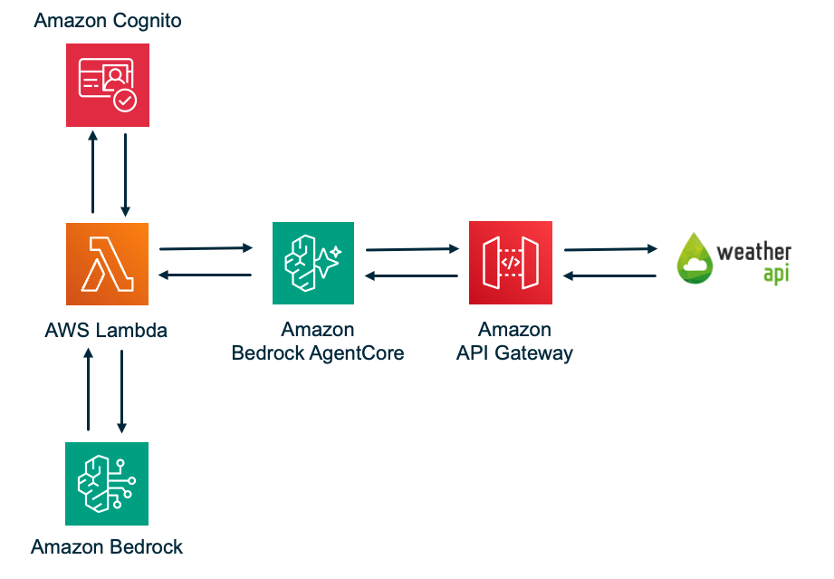

# AgentCore API Gateway Weather Agent

A serverless AI weather agent built on AWS Bedrock AgentCore. Uses the Strands SDK to orchestrate an LLM (Claude Sonnet 4.6) that calls weather tools exposed through an AgentCore Gateway backed by API Gateway and WeatherAPI.com.

## Architecture



```
User → Agent Lambda → AgentCore Gateway (MCP) → API Gateway → WeatherAPI.com
         │                    │                      │
    Strands Agent        CUSTOM_JWT Auth         API Key Auth
    + BedrockModel       + MCP Routing           (credential
    + MCPClient          + Tool Discovery         provider)
         │
    Cognito JWT
    Validated
```

The LLM decides which tool to call. AgentCore auto-discovers available tools from the API Gateway's OpenAPI export and presents them to the agent via MCP `tools/list`. When the agent calls a tool, AgentCore routes the request to API Gateway, authenticating with an API key managed by a credential provider.

## Prerequisites

- AWS CLI 2.28+ (required for `bedrock-agentcore-control` commands)
- Python 3.12+
- pip3
- A [WeatherAPI.com](https://www.weatherapi.com/) API key (free tier works)
- An S3 bucket for Lambda deployment packages (if zip exceeds 50MB)
- AWS account with Bedrock and AgentCore enabled in `us-east-1`

## Quick Start

### Step 1: Open a Terminal

Open a terminal on your machine and navigate to where you want to clone the project.

### Step 2: Clone the Repository

```bash
git clone https://github.com/aws-samples/serverless-patterns
cd serverless-patterns/strands-agentcore-apigw
```

### Step 3: Deploy

```bash
./scripts/deploy.sh \
  --environment-name dev \
  --weather-api-key YOUR_WEATHERAPI_KEY \
  --region us-east-1 \
  --s3-bucket YOUR_S3_BUCKET
```

The default LLM is `us.anthropic.claude-sonnet-4-6`. To use a different model, add `--bedrock-model-id`:

```bash
./scripts/deploy.sh \
  --environment-name dev \
  --weather-api-key YOUR_WEATHERAPI_KEY \
  --bedrock-model-id us.anthropic.claude-haiku-4-5-20251001-v1:0
```

See [Changing the Model](#changing-the-model) for available model IDs.

The script handles everything in order:
1. Validates the CloudFormation template
2. Creates Secrets Manager secrets (WeatherAPI key + API Gateway key)
3. Deploys the CloudFormation stack (API Gateway, AgentCore Gateway, Cognito, Lambda, IAM)
4. Retrieves the API Gateway key and updates Secrets Manager
5. Creates/updates the AgentCore credential provider via CLI
6. Updates the stack with the credential provider ARN
7. Packages and deploys the Lambda code (two-step pip install for binary + pure Python deps)
8. Creates a test user in Cognito
9. Generates `scripts/test.sh` with baked-in values

### 2. Test

```bash
./scripts/test.sh
./scripts/test.sh 'What is the weather in Liverpool, England?'
```

The test script authenticates via Cognito, gets an ID token, and invokes the Lambda with your prompt.

## Parameters

| Parameter | Required | Description |
|-----------|----------|-------------|
| `--environment-name` | Yes | Environment name (e.g. `dev`, `staging`, `prod`). Used for resource namespacing. |
| `--weather-api-key` | Yes | Your WeatherAPI.com API key |
| `--region` | No | AWS region (default: `us-east-1`) |
| `--s3-bucket` | No | S3 bucket for Lambda packages >50MB |
| `--bedrock-model-id` | No | Bedrock model ID (default: `us.anthropic.claude-sonnet-4-6`) |


## Project Structure

```
├── infrastructure/
│   └── cloudformation-template.yaml   # Full stack: API GW, AgentCore, Cognito, Lambda, IAM
├── scripts/
│   ├── deploy.sh                      # One-command deployment script
│   └── test.sh                        # Generated after deploy — end-to-end test
├── src/
│   ├── agent/
│   │   ├── handler.py                 # Lambda entry point
│   │   ├── agent_processor.py         # MCP client + Strands Agent lifecycle
│   │   └── strands_client.py          # Factory functions
│   └── shared/
│       ├── models.py                  # UserContext, AgentRequest, AgentResponse
│       ├── jwt_utils.py               # JWT validation (Cognito ID tokens)
│       ├── error_utils.py             # Error handling
│       └── logging_utils.py           # Structured logging
├── tests/
│   ├── unit/
│   │   ├── test_cloudformation_template.py
│   │   ├── test_properties.py         # Property-based tests
│   │   └── conftest.py
│   └── integration/
│       └── test_e2e.py
├── handoff/                           # Reference patterns (do not modify)
├── requirements.txt                   # Lambda dependencies
└── README.md
```

## Changing the Model

The model is controlled by the `--bedrock-model-id` parameter. Claude Sonnet 4.6 and newer models on Bedrock **require a cross-region inference profile ID** — using the bare `anthropic.*` model ID will result in a `ValidationException`.

Profile IDs follow the pattern `<routing>.<model-id>`:
- `us.*` — routes within the US (lower latency for US-based workloads)
- `global.*` — routes globally (higher availability)

### Available Claude 4.x inference profiles

| Profile ID | Model |
|------------|-------|
| `us.anthropic.claude-sonnet-4-6` | Claude Sonnet 4.6 (US) — **default** |
| `global.anthropic.claude-sonnet-4-6` | Claude Sonnet 4.6 (Global) |
| `us.anthropic.claude-sonnet-4-5-20250929-v1:0` | Claude Sonnet 4.5 (US) |
| `us.anthropic.claude-sonnet-4-20250514-v1:0` | Claude Sonnet 4 (US) |
| `us.anthropic.claude-opus-4-7` | Claude Opus 4.7 (US) |
| `us.anthropic.claude-haiku-4-5-20251001-v1:0` | Claude Haiku 4.5 (US) — fastest/cheapest |

### Example

```bash
./scripts/deploy.sh \
  --environment-name dev \
  --weather-api-key YOUR_WEATHERAPI_KEY \
  --bedrock-model-id us.anthropic.claude-haiku-4-5-20251001-v1:0
```

### Changing the model on an existing deployment

Re-run `deploy.sh` with the new model ID — no teardown needed. The script updates the CloudFormation stack and redeploys the Lambda:

```bash
./scripts/deploy.sh \
  --environment-name dev \
  --weather-api-key YOUR_WEATHERAPI_KEY \
  --bedrock-model-id us.anthropic.claude-opus-4-7
```

Alternatively, update just the Lambda environment variable directly (faster, skips infrastructure steps):

```bash
# 1. Get current environment variables
CURRENT_ENV=$(aws lambda get-function-configuration \
  --function-name dev-weather-agent \
  --region us-east-1 \
  --query 'Environment.Variables' --output json)

# 2. Update BEDROCK_MODEL_ID in place
NEW_ENV=$(echo $CURRENT_ENV | python3 -c "
import json, sys
env = json.load(sys.stdin)
env['BEDROCK_MODEL_ID'] = 'us.anthropic.claude-opus-4-7'
print(json.dumps({'Variables': env}))
")

# 3. Apply
aws lambda update-function-configuration \
  --function-name dev-weather-agent \
  --environment "$NEW_ENV" \
  --region us-east-1
```

To list all available inference profiles in your account:

```bash
aws bedrock list-inference-profiles --region us-east-1 \
  --query "inferenceProfileSummaries[].{id:inferenceProfileId,name:inferenceProfileName}" \
  --output table
```


```bash
# Delete credential provider (not managed by CloudFormation)
aws bedrock-agentcore-control delete-api-key-credential-provider \
  --name dev-weather-apigw-key --region us-east-1

# Delete the stack
aws cloudformation delete-stack --stack-name dev-weather-agent --region us-east-1
aws cloudformation wait stack-delete-complete --stack-name dev-weather-agent --region us-east-1

# Delete secrets
aws secretsmanager delete-secret --secret-id "dev/weather-api-key" \
  --force-delete-without-recovery --region us-east-1
aws secretsmanager delete-secret --secret-id "dev/apigw-api-key" \
  --force-delete-without-recovery --region us-east-1
```

Replace `dev` with your environment name if different.

## Running Tests

```bash
# Unit tests
python -m pytest tests/unit/ -v

# Property-based tests
python -m pytest tests/unit/test_properties.py -v
```

## Key Implementation Notes

- **Two separate API keys**: One for AgentCore → API Gateway (managed by credential provider), another for API Gateway → WeatherAPI.com (injected via stage variable from Secrets Manager)
- **Two-step pip install**: `--only-binary=:all:` with `--platform` silently skips pure Python packages. The deploy script runs a second install with `--no-deps` for `requests`, `PyJWT`, etc.
- **JWT validation**: Accepts both access and ID tokens. Audience verification is disabled (AgentCore Gateway handles it via `AllowedAudience`)
- **Credential provider**: Not a CloudFormation resource — managed via CLI. The deploy script auto-detects CLI support and creates/updates it, with fallback to manual instructions
- **Region**: Must be `us-east-1` (AgentCore availability)
- **Bedrock model ID — inference profile required**: Claude Sonnet 4.6 does not support direct on-demand invocation on Bedrock. You must use a cross-region inference profile ID. The default is `us.anthropic.claude-sonnet-4-6` (US profile). Using the bare `anthropic.claude-sonnet-4-6` ID will result in a `ValidationException`. If you need global routing, use `global.anthropic.claude-sonnet-4-6` instead.
- **Raw CloudFormation instead of SAM**: SAM works with this stack (a SAM template is a superset of CloudFormation, so all the `AWS::BedrockAgentCore::*`, Cognito, and IAM resources pass through untouched), but it buys almost nothing here. Of the ~16 resources, SAM's `AWS::Serverless::*` shorthand only applies to one — the Lambda function — and that benefit is undercut two ways: the function deploys a placeholder and its real code is pushed separately by `scripts/deploy.sh` (which does a custom two-step `--platform manylinux2014` install for binary wheels that `sam build` doesn't handle out of the box), and the API Gateway uses a direct `HTTP_PROXY` integration to WeatherAPI.com with no Lambda behind it, so `AWS::Serverless::Api` adds nothing. The genuinely awkward part of this deployment — creating the AgentCore credential provider via CLI *between* stack operations and feeding its ARN into a follow-up update — is something neither SAM nor CloudFormation simplifies. So raw CloudFormation keeps the flow explicit without adding a transform that would expand nothing. (Note: the credential provider is provisioned via CLI for historical reasons — AgentCore reached GA with CloudFormation support in September 2025, and `AWS::BedrockAgentCore::ApiKeyCredentialProvider` is now an available resource type, so migrating it into the template is a possible future simplification.)

---

Copyright 2026 Amazon.com, Inc. or its affiliates. All Rights Reserved.

SPDX-License-Identifier: MIT-0
