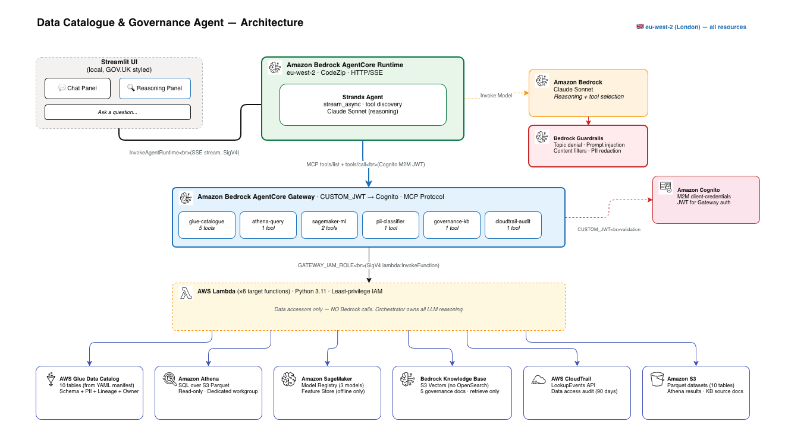

# Data Catalogue & Governance Agent

A conversational AI agent that gives data analysts, caseworkers and policy teams
natural-language access to a data estate — finding datasets, understanding their
contents, checking sensitivity, tracing lineage, querying live data and answering
governance questions — with every reasoning step streamed live to the UI.

The scenario is modelled on the UK **Department for Work and Pensions (DWP)**
data estate. All data is **synthetic and fictional** — no real people, National
Insurance numbers or case references.

> This is one pattern in the `strands-agentcore-patterns` collection. It
> demonstrates a **single Strands agent on Amazon Bedrock AgentCore Runtime**
> orchestrating **six Lambda tool targets (11 tools) through one AgentCore
> Gateway**, plus a Bedrock Knowledge Base on S3 Vectors — the "many tools, one
> transparent agent" pattern.

---

## Why build this?

Amazon **DataZone / SageMaker Catalog** is the right answer for a *production*
data catalogue. This project is **not** trying to replace it. DataZone gives you
a catalogue portal. This app gives you a **transparent AI agent that orchestrates
across the catalogue and beyond**. They solve different problems — and in a
production world you'd likely use both (DataZone as the governed catalogue, an
agent like this as the conversational interface layer on top).

The demo demonstrates an **agentic pattern** (Strands + AgentCore + Gateway) that
can sit on top of any set of services and orchestrate them transparently.

For customers who **cannot or choose not to use DataZone / SageMaker Catalog** —
whether due to regional availability, compliance constraints, existing
infrastructure, or the need for a fully customisable approach — this pattern
gives them the same intelligent data discovery and governance capabilities, built
entirely from services they already have (Glue, Athena, S3, Bedrock), in any
region where those services are available.

### What it demonstrates

- **Natural-language orchestration across your data estate** — Athena, S3, Glue,
  SageMaker, Knowledge Bases, and any other source you wire in: Redshift, Lake
  Formation, CloudTrail, or third-party tools like Snowflake, SharePoint,
  ServiceNow, Jira.
- **It doesn't just find things — it reasons across them.** One question can
  search the catalogue, classify sensitivity, trace lineage, check governance
  policy, and query live data, all in a single turn with visible reasoning.
- **Adding a new data source is one Lambda + one Gateway target registration** —
  the agent discovers and uses it automatically in the next invocation. No
  retraining, no redeployment of the agent itself.
- **Visible reasoning** — a live panel shows each tool call and the AWS service
  it accessed, so users see *real* orchestration rather than a black box.
- **Bespoke governance Q&A** grounded in *your own* policy documents, with
  citations (Bedrock Knowledge Base territory, not a catalog feature).
- **In-region** (eu-west-2 / London) for data residency, using Bedrock directly.

### How this relates to AWS Context

AWS announced **AWS Context** (June 2026) — a managed service that automatically
maps data relationships into a knowledge graph and provides agentic search so AI
agents can access governed context at runtime. It also introduced **Glue Data
Catalog Business Context** (enriched metadata + skill assets) and **S3
Annotations** (queryable business context attached to S3 objects, discoverable
via an S3 Tables MCP server).

This demo and AWS Context share the same thesis: *agents are only as intelligent
as the context they can reason over*. The difference is scope:

| | This demo | AWS Context |
|---|---|---|
| Scale | 10 tables, manual metadata | Enterprise-wide, auto-inferred knowledge graph |
| Lineage | JSON in Glue table properties | Auto-mapped, self-improving from agent usage |
| Governance | Static policy docs in a KB | Identity-aware, IAM + Lake Formation at query time |
| Availability | Any region, today, from existing services | Coming soon (announced June 2026) |

**They're complementary, not competing.** For customers who want this capability
today — or in regions where AWS Context isn't yet available, or who need full
customisation — this pattern shows how to build it from Glue + Athena + Bedrock
KB + AgentCore Gateway. When AWS Context becomes generally available, it plugs in
as another Gateway target. The agent pattern doesn't change.

### What the agent can do

| Capability | Tool | How it works | Example question |
|---|---|---|---|
| Dataset discovery | `search_catalogue` | Fetches all tables from Glue Data Catalog; the agent reasons over descriptions to find relevant datasets | "I'm building a dashboard for the Minister on fraud — what should I include?" |
| Dataset detail | `get_dataset_detail` | Calls `glue.get_table()` to return full column schema, types, descriptions, owner, steward, and S3 location | "What columns are in the CMS payment history table?" |
| PII classification | `classify_pii` | Returns column schema from Glue; the agent then classifies each column (NONE/LOW/MEDIUM/HIGH) using its own reasoning | "Which datasets contain National Insurance numbers?" |
| Data lineage | `show_lineage` | Reads lineage metadata (upstream, downstream, transformation) stored in Glue table parameters | "Who owns the data behind the service performance KPIs?" |
| Metadata generation | `generate_metadata` | Returns table schema from Glue; the agent generates FAIR-compliant descriptions (write-back disabled by default) | "The jcs_chatbot_interactions table has no description — generate FAIR-compliant metadata so we can publish it in the catalogue" |
| Join recommendations | `suggest_joins` | Fetches all tables with their column names/types from Glue; the agent identifies common keys and recommends joins | "How do I link fraud referrals to payment history?" |
| Live SQL query | `query_dataset` | Agent retrieves table schema via Glue, generates a SELECT query, then executes it on Athena (read-only, LIMIT 100) | "Show me Universal Credit payments over £100" |
| Governance Q&A | `policy_search` | Calls Bedrock Knowledge Base `retrieve` to get relevant policy document chunks; the agent synthesises the answer with citations | "What happens if we discover a data breach in a HIGH PII dataset — what's the process?" |
| ML asset discovery | `list_ml_models` | Lists SageMaker Model Registry groups and offline Feature Store groups | "We're being audited on our use of AI in decision-making — what models do we have, what data were they trained on, and can we trace it back to source?" |
| ML asset detail | `describe_ml_asset` | Calls `describe_model_package` or `describe_feature_group` on SageMaker to return metrics, status, and data sources | "What accuracy does the fraud detection model achieve, and should we trust it for referral decisions?" |
| Data access audit | `audit_access` | Queries CloudTrail LookupEvents for Athena queries and Glue metadata access referencing a table over the last N days; returns principals, timestamps, and IPs | "Who accessed the fraud payment data in the last 30 days — and should they have?" |

---

## Architecture




### Key design decisions

- **The orchestrator owns ALL LLM reasoning.** Target Lambdas are dumb data
  accessors — they call AWS APIs and return structured data; they never call
  Bedrock. PII classification, SQL generation and governance-answer synthesis
  all happen in the agent. This avoids "Claude calling a tool that calls Claude"
  and keeps the targets cheap and fast.
- **Knowledge Base is `retrieve`-only** (not `retrieve_and_generate`). The target
  returns ranked chunks; the orchestrator synthesises the answer and citations,
  so the synthesis is visible in the reasoning panel.
- **S3 Vectors as the KB vector store** (not OpenSearch Serverless) — no standing
  cost.
- **Glue tables created directly** (no Crawler). Table definitions *and* the
  Parquet data generator are driven from a **single YAML manifest**
  (`data/manifest.yaml`) — schema and data can't drift.
- **Safety is IAM-enforced, not prompt-enforced.** The Athena target role is
  read-only Glue + read-only S3 with a dedicated workgroup; `generate_metadata`
  write-back is disabled (no `glue:UpdateTable` on the role unless a deploy flag
  enables it). The orchestrator also applies `LIMIT 100` and never emits DML/DDL,
  but IAM is the real guardrail.
- **Bedrock Guardrails** applied at the model invocation layer — blocks off-topic
  requests, prompt injection attempts, and harmful content before they reach the
  LLM. PII redaction configured as a safety net on outputs.

### Authentication (two boundaries)

| Boundary | Direction | Mechanism |
|---|---|---|
| Inbound | Streamlit → Runtime | SigV4 / IAM (local AWS credentials) |
| M2M | Agent → Gateway | Cognito client-credentials (JWT), validated by the Gateway's CUSTOM_JWT authorizer |
| Gateway → Lambda | outbound | `GATEWAY_IAM_ROLE` (SigV4 `lambda:InvokeFunction`) |

---

## AWS services used

| Service | Role |
|---|---|
| Bedrock AgentCore Runtime | Hosts the Strands agent (CodeZip, HTTP/SSE streaming) |
| Bedrock AgentCore Gateway | Aggregates 6 Lambda targets into one MCP tool list |
| Amazon Bedrock (Claude Sonnet) | Agent reasoning, NL understanding, SQL/metadata generation |
| Amazon Bedrock Guardrails | Content safety — topic denial, prompt injection blocking, PII redaction |
| Amazon Bedrock (Titan Text Embeddings V2) | Embeddings for the Knowledge Base |
| Bedrock Knowledge Base + S3 Vectors | RAG over governance documents (`retrieve` only) |
| AWS Lambda (×6) | Data-accessor tool targets behind the Gateway |
| AWS Glue Data Catalog | Metadata store (tables created directly, no Crawler) |
| Amazon Athena | Serverless SQL over S3 Parquet (read-only, dedicated workgroup) |
| Amazon SageMaker | Model Registry + offline Feature Store (metadata only) |
| Amazon Cognito | M2M auth (agent → Gateway) |
| AWS CloudTrail | Data access auditing via LookupEvents API (Athena queries + Glue metadata access, 90-day history) |
| Amazon S3 | Parquet datasets, Athena results, KB source docs, S3 Vectors |

---

## Project structure

```
strands-agentcore-datacatalogue/
├── agent/                    # Strands orchestrator (deployed to Runtime, CodeZip)
│   ├── main.py               #   entrypoint: token → Gateway (MCP) → stream_async
│   ├── system_prompt.txt     #   agent instructions (PII rules, SQL safety, citations)
│   └── pyproject.toml
├── targets/                  # 6 Lambda tool targets (11 tools total)
│   ├── glue_catalogue/       #   search_catalogue, get_dataset_detail, show_lineage,
│   │                         #   generate_metadata, suggest_joins
│   ├── athena_query/         #   query_dataset (read-only IAM + dedicated workgroup)
│   ├── sagemaker_ml/         #   list_ml_models, describe_ml_asset
│   ├── pii_classifier/       #   classify_pii (returns schema only; agent reasons)
│   ├── governance_kb/        #   policy_search (Bedrock KB retrieve only)
│   └── cloudtrail_audit/     #   audit_access (CloudTrail Lake query)
├── tools/                    # Inline MCP tool schemas per target (Gateway registration)
├── infra/                    # AWS CDK (Python) — data-plane stacks
│   ├── app.py
│   └── stacks/               #   data platform, Cognito, Knowledge Base, ML, Lambdas
├── scripts/
│   ├── deploy_gateway.py     #   creates Gateway + 6 targets (boto3 control plane)
│   ├── create_glue_tables.py #   Glue tables from manifest
│   ├── register_ml_assets.py #   SageMaker model packages + feature group
│   ├── sync_knowledge_base.py#   trigger + wait for KB ingestion
│   └── populate_agentcore_json.py
├── data/
│   ├── manifest.yaml         # SINGLE source of truth: 10 tables (schema + data + lineage)
│   ├── generate_parquet.py   #   generates fictional Parquet from the manifest
│   └── governance_docs/      #   5 synthetic policy docs for the Knowledge Base
├── frontend/
│   ├── app.py                # Streamlit UI (GOV.UK styled, live reasoning panel)
│   └── run_ui.sh             #   launch helper
├── spike/                    # Step 0.5 streaming validation spike (proves SSE fidelity)
├── spec/                     # requirements.md, design.md, tasks.md
├── setup.sh                  # one-command data-plane deploy
├── teardown.sh               # full cleanup
└── smoke_test.py             # 11 demo scenarios, one retry + backoff each
```

---

## Prerequisites

1. **AWS account** with credentials configured for **eu-west-2** and permission to
   create Bedrock, AgentCore, Lambda, Glue, Athena, SageMaker, Cognito, S3 and IAM
   resources.
2. **Bedrock model access enabled** in the eu-west-2 console (one-time, per
   account) for:
   - Anthropic **Claude Sonnet** (`anthropic.claude-sonnet-4-6`)
   - Amazon **Titan Text Embeddings V2** (`amazon.titan-embed-text-v2:0`)
3. **Tooling:** Python 3.13+, Node.js (for the CDK CLI via `npx aws-cdk@latest`),
   the [`bedrock-agentcore` CLI](https://pypi.org/project/bedrock-agentcore-starter-toolkit/)
   (`pip install bedrock-agentcore-starter-toolkit`), and `uv`.

---

## Deployment

The deploy is split by responsibility:

- **AWS CDK** provisions the data plane (S3, Glue, Athena, Cognito, Knowledge
  Base, SageMaker, the 6 Lambda targets and their IAM roles).
- **The AgentCore CLI + a boto3 script** provision the AgentCore layer (Gateway,
  its 6 targets, and the Runtime agent).

> **Region is eu-west-2 throughout.** A streaming spike (`spike/`) validates that
> AgentCore Runtime delivers SSE events incrementally *before* the full build —
> run it first if you want to de-risk the streaming path.

### Step 1 — Create a virtualenv and install tooling

```bash
cd strands-agentcore-datacatalogue
python3 -m venv .venv && source .venv/bin/activate
pip install aws-cdk-lib constructs boto3 pyyaml pandas pyarrow faker requests \
            streamlit bedrock-agentcore-starter-toolkit
```

### Step 2 — Deploy the data plane (CDK)

```bash
cd infra
npx aws-cdk@latest bootstrap aws://<ACCOUNT_ID>/eu-west-2   # once per account
npx aws-cdk@latest deploy --all --require-approval never \
    --outputs-file ../cdk-outputs.json
cd ..
```

This creates the S3 buckets, Glue database + Athena workgroup, Cognito user pool
+ M2M app client, the Bedrock Knowledge Base (S3 Vectors) and the 6 Lambda tool
functions with least-privilege roles.

> **S3 Vectors note:** the vector bucket and index for the Knowledge Base are
> created via the `s3vectors` API (see `setup.sh`). The index must exist before
> the KB is created, and its `AMAZON_BEDROCK_METADATA` key must be non-filterable.

### Step 3 — Load data, ML assets and the Knowledge Base

```bash
# 1. Generate + upload synthetic Parquet
python data/generate_parquet.py
aws s3 sync data/parquet/ s3://<DATA_BUCKET>/ --region eu-west-2

# 2. Create Glue tables from the manifest
python scripts/create_glue_tables.py --bucket <DATA_BUCKET>

# 3. Register SageMaker model packages + feature group
python scripts/register_ml_assets.py --bucket <DATA_BUCKET>

# 4. Upload governance docs and sync the Knowledge Base
aws s3 sync data/governance_docs/ s3://<KB_SOURCE_BUCKET>/ --region eu-west-2
python scripts/sync_knowledge_base.py --kb-id <KB_ID> --datasource-id <DS_ID>
```

(`setup.sh` orchestrates Steps 2–3 end-to-end; the manual breakdown is shown for
clarity. Bucket names and IDs are in `cdk-outputs.json`.)

### Step 4 — Deploy the AgentCore Gateway + 6 targets

```bash
python scripts/deploy_gateway.py
# → writes gateway-outputs.json (gateway_id, gateway_url, discovery_url)
```

The Gateway is created with a **CUSTOM_JWT authorizer** pointed at the Cognito
pool and the M2M app client; each target registers its Lambda ARN plus an inline
MCP tool schema from `tools/`.

### Step 5 — Deploy the Strands agent to AgentCore Runtime

```bash
# Scaffold an agentcore project, drop in agent/main.py + system_prompt.txt,
# set region eu-west-2 / Python 3.13, then:
agentcore deploy \
  --env GATEWAY_URL=<gateway_url> \
  --env COGNITO_TOKEN_ENDPOINT=<token_endpoint> \
  --env COGNITO_M2M_CLIENT_ID=<m2m_client_id> \
  --env COGNITO_M2M_CLIENT_SECRET=<m2m_client_secret> \
  --env COGNITO_M2M_SCOPE=dwp-demo-api/gateway.tools
```

Verify end-to-end:

```bash
agentcore invoke '{"prompt": "Which datasets contain National Insurance numbers?"}'
```

### Step 6 — Run the UI

```bash
cd frontend
export AGENT_RUNTIME_ARN=<runtime_arn>
./run_ui.sh          # opens http://localhost:8501
```

The UI authenticates to the Runtime with **SigV4 using your local AWS
credentials**, so there are no tokens to manage locally.

---

## Using the agent

Open **http://localhost:8501** and ask a question. The left panel shows the
conversation; the right panel streams each tool call and result live.

**A good "wow" question** that chains five AWS services in one request:

> *I'm a new data analyst joining the counter-fraud team. Find the fraud
> datasets, tell me which ones contain National Insurance numbers, show me where
> that data comes from and who owns it, check whether I'm allowed to share it
> with HMRC, and tell me what ML models we have for fraud detection.*

Watch the reasoning panel run `search_catalogue` → `classify_pii` →
`show_lineage` → `policy_search` → `list_ml_models`, then synthesise a single
briefing.

### Smoke test

```bash
export AGENT_RUNTIME_ARN=<runtime_arn>
python smoke_test.py     # runs the 11 demo scenarios, one retry + backoff each
```

---

## Teardown

```bash
./teardown.sh
```

This removes the AgentCore Runtime and Gateway, empties and deletes the S3
buckets, deletes the SageMaker assets, and destroys the CDK stacks. It must also
remove the **S3 Vectors bucket/index** and the **Cognito pool** (both included).

If you deployed the Gateway/Runtime manually, delete them explicitly:

```bash
# Gateway + targets
python -c "import boto3; c=boto3.client('bedrock-agentcore-control','eu-west-2'); \
  [c.delete_gateway_target(gatewayIdentifier=g, targetId=t['targetId']) \
   for g in [x['gatewayId'] for x in c.list_gateways()['items']] \
   for t in c.list_gateway_targets(gatewayIdentifier=g)['items']]"
# then delete_gateway for each, and:
agentcore destroy
```

> **Cost note:** the design deliberately avoids standing-cost services (S3 Vectors
> instead of OpenSearch Serverless, offline-only Feature Store, pay-per-use
> AgentCore). After teardown the account should return to zero ongoing charges.

---

## Notes and caveats

- **All data is synthetic.** The DWP framing is illustrative; there are no real
  people, NINOs or case references.
- **Testing is demo-level.** One integration smoke script over the 11 scenarios
  (with one retry + backoff each) — no mocked unit tests, no load testing.
- **Lambda tool contract.** AgentCore Gateway passes the tool name via
  `context.client_context.custom['bedrockAgentCoreToolName']` and the event body
  *is* the tool arguments. Handlers return the result object directly (not
  wrapped in `statusCode`/`body`).
- **Tool schemas.** The Gateway's tool-schema validator does not accept the
  `enum` keyword inside an input schema property — encode allowed values in the
  property `description` instead.
- **`generate_metadata` write-back** is disabled by default and IAM-gated. Enable
  it only via the deploy flag if you specifically want to demonstrate catalogue
  mutation.

---

## License

Copyright 2026 Amazon.com, Inc. or its affiliates. All Rights Reserved.
SPDX-License-Identifier: MIT-0
