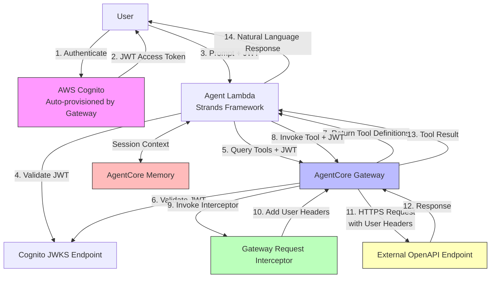
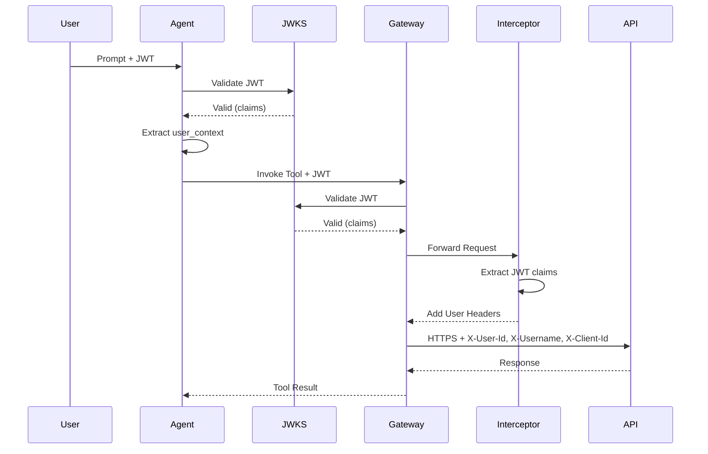

# Design Document: Serverless AI Agent Gateway with OpenAPI Targets

## Overview

This document describes the design for a serverless AI agent system that enables natural language interaction with external REST APIs through AWS Bedrock AgentCore Gateway using OpenAPI specifications. The system demonstrates secure multi-tenant AI agents with complete user context propagation through Gateway Request Interceptors.

### Key Design Principles

1. **User Context Propagation**: User identity flows through every layer (Agent → Gateway → Interceptor → OpenAPI Endpoint) via JWT validation and header injection
2. **Defense in Depth**: JWT validation occurs at multiple layers (Agent Lambda, AgentCore Gateway)
3. **Fail-Safe Interceptor**: Gateway Request Interceptor never breaks the request flow, returning original request on errors
4. **Infrastructure as Code**: Complete CloudFormation automation for reproducible deployments
5. **OpenAPI-First Integration**: External REST APIs are integrated via OpenAPI specifications rather than Lambda functions

### Architecture Comparison

This design is an OpenAPI variant of the Lambda-based implementation. The key difference is that tools are external REST APIs defined by OpenAPI specifications instead of Lambda functions. The Gateway Request Interceptor adds user context as HTTP headers (X-User-Id, X-Username, X-Client-Id) instead of injecting into Lambda event parameters.

## Architecture

### System Components



### Request Flow

1. **Authentication Phase**
   - User authenticates with Cognito (auto-provisioned by Gateway)
   - Cognito issues JWT access token with claims: sub (user_id), username, client_id

2. **Agent Processing Phase**
   - User submits natural language prompt with JWT token
   - Agent Lambda validates JWT using Cognito JWKS
   - Agent extracts user context from JWT claims
   - Agent queries AgentCore Gateway for available OpenAPI tools (includes JWT)
   - Gateway validates JWT independently and returns tool definitions

3. **Tool Discovery Phase**
   - Agent receives OpenAPI tool definitions from Gateway
   - Agent passes tool definitions to Claude 3 Sonnet via Bedrock
   - Claude analyzes prompt and selects appropriate OpenAPI tool

4. **Tool Execution Phase**
   - Agent invokes selected tool through AgentCore Gateway (includes JWT)
   - Gateway validates JWT and invokes Gateway Request Interceptor
   - Interceptor extracts user context from JWT claims
   - Interceptor adds user context as HTTP headers (X-User-Id, X-Username, X-Client-Id)
   - Gateway constructs HTTP request per OpenAPI specification
   - Gateway invokes external OpenAPI endpoint via HTTPS with user headers
   - OpenAPI endpoint processes request with user attribution
   - Response flows back through Gateway to Agent

5. **Response Generation Phase**
   - Agent stores conversation turn in AgentCore Memory with session context
   - Agent generates natural language response based on tool results
   - Response returned to user

### Multi-Layer JWT Validation



## Components and Interfaces

### 1. Agent Lambda (Strands Framework)

**Responsibility**: Orchestrate AI conversation, validate JWT, invoke tools, manage memory

**Technology**: Python 3.12, Strands Framework, AWS Bedrock Runtime

**Key Functions**:

```python
def lambda_handler(event: Dict[str, Any], context: Any) -> Dict[str, Any]:
    """
    Main entry point for Agent Lambda.
    
    Args:
        event: API Gateway event with:
            - headers.Authorization: Bearer <jwt_token>
            - body: JSON with prompt and optional session_id
        context: AWS Lambda context
        
    Returns:
        API Gateway response with agent's natural language response
    """
    pass

def validate_jwt_token(token: str, jwks_url: str) -> Dict[str, Any]:
    """
    Validate JWT access token using Cognito JWKS.
    
    Args:
        token: JWT access token
        jwks_url: Cognito JWKS URL
        
    Returns:
        Decoded JWT claims
        
    Raises:
        ValueError: If token is invalid or expired
    """
    pass

def extract_user_context(claims: Dict[str, Any]) -> UserContext:
    """
    Extract user context from JWT claims.
    
    Args:
        claims: Decoded JWT claims
        
    Returns:
        UserContext with user_id, username, client_id
    """
    pass

def query_gateway_tools(gateway_id: str, jwt_token: str) -> List[Dict[str, Any]]:
    """
    Query AgentCore Gateway for available OpenAPI tools.
    
    Args:
        gateway_id: AgentCore Gateway ID
        jwt_token: JWT access token for authorization
        
    Returns:
        List of tool definitions in Claude-compatible format
    """
    pass

def invoke_gateway_tool(
    gateway_id: str,
    tool_name: str,
    parameters: Dict[str, Any],
    jwt_token: str
) -> Dict[str, Any]:
    """
    Invoke OpenAPI tool through AgentCore Gateway.
    
    Args:
        gateway_id: AgentCore Gateway ID
        tool_name: OpenAPI operation ID
        parameters: Tool parameters
        jwt_token: JWT access token for authorization
        
    Returns:
        Tool execution result
    """
    pass

def invoke_bedrock_model(
    messages: List[Dict[str, Any]],
    tools: List[Dict[str, Any]]
) -> Dict[str, Any]:
    """
    Invoke Claude 3 Sonnet via Bedrock with tool definitions.
    
    Args:
        messages: Conversation history
        tools: Available tool definitions from Gateway
        
    Returns:
        Model response with tool usage or text response
    """
    pass

def store_conversation_turn(
    memory_id: str,
    session_id: str,
    user_id: str,
    turn: Dict[str, Any]
) -> None:
    """
    Store conversation turn in AgentCore Memory.
    
    Args:
        memory_id: AgentCore Memory ID
        session_id: Session identifier
        user_id: User identifier for multi-tenant isolation
        turn: Conversation turn data
    """
    pass

def retrieve_conversation_context(
    memory_id: str,
    session_id: str,
    user_id: str,
    max_turns: int = 10
) -> List[Dict[str, Any]]:
    """
    Retrieve conversation context from AgentCore Memory.
    
    Args:
        memory_id: AgentCore Memory ID
        session_id: Session identifier
        user_id: User identifier for multi-tenant isolation
        max_turns: Maximum number of turns to retrieve
        
    Returns:
        List of conversation turns
    """
    pass
```

**Environment Variables**:
- `GATEWAY_ID`: AgentCore Gateway ID
- `MEMORY_ID`: AgentCore Memory ID
- `COGNITO_JWKS_URL`: Cognito JWKS endpoint URL
- `BEDROCK_MODEL_ID`: Claude model ID (anthropic.claude-3-sonnet-20240229-v1:0)
- `LOG_LEVEL`: Logging level (INFO, DEBUG)

**IAM Permissions**:
- `bedrock:InvokeModel` - Invoke Claude via Bedrock
- `bedrock:InvokeGateway` - Invoke AgentCore Gateway
- `bedrock:GetMemory`, `bedrock:PutMemory` - Access AgentCore Memory

### 2. AgentCore Gateway

**Responsibility**: Mediate communication between Agent and OpenAPI endpoints, validate JWT, invoke interceptor

**Technology**: AWS Bedrock AgentCore Gateway (managed service)

**Configuration**:
- Auto-provisions Cognito User Pool with OAuth2
- Validates JWT tokens using Cognito JWKS
- Manages OpenAPI target definitions
- Invokes Gateway Request Interceptor before OpenAPI calls
- Constructs HTTP requests per OpenAPI specifications
- Validates requests/responses against OpenAPI schemas

**Gateway Targets**: Each OpenAPI endpoint is configured as a Gateway Target with:
- Target name (maps to OpenAPI operation ID)
- OpenAPI specification (inline JSON/YAML or URL reference)
- Base URL for the external API
- Authentication configuration (API keys, OAuth2, Bearer tokens)

### 3. Gateway Request Interceptor Lambda

**Responsibility**: Extract JWT claims and add user context headers to OpenAPI requests

**Technology**: Python 3.12

**Key Functions**:

```python
def lambda_handler(event: Dict[str, Any], context: Any) -> Dict[str, Any]:
    """
    Gateway Request Interceptor handler.
    
    Args:
        event: Gateway interceptor event with:
            - mcp.gatewayRequest.headers.Authorization: Bearer <jwt_token>
            - mcp.gatewayRequest.body: OpenAPI request details
        context: AWS Lambda context
        
    Returns:
        Transformed request with user context headers:
            - X-User-Id: User identifier
            - X-Username: Username
            - X-Client-Id: Client identifier
    """
    pass

def extract_user_context_from_jwt(jwt_token: str) -> Optional[UserContext]:
    """
    Extract user context from JWT token payload.
    
    Args:
        jwt_token: JWT access token
        
    Returns:
        UserContext if extraction succeeds, None otherwise
        
    Note: Does NOT validate JWT signature (Gateway already validated)
    """
    pass

def add_user_headers(
    request: Dict[str, Any],
    user_context: UserContext
) -> Dict[str, Any]:
    """
    Add user context as HTTP headers to OpenAPI request.
    
    Args:
        request: Original OpenAPI request
        user_context: User identity information
        
    Returns:
        Transformed request with X-User-Id, X-Username, X-Client-Id headers
    """
    pass
```

**Critical Design Decision**: The interceptor MUST return the original request unchanged if any error occurs. This ensures the Gateway can still invoke the OpenAPI endpoint even if user context extraction fails.

**Environment Variables**:
- `LOG_LEVEL`: Logging level

**IAM Permissions**: None required (invoked by Gateway with execution role)

### 4. AgentCore Memory

**Responsibility**: Store and retrieve conversation context with session management

**Technology**: AWS Bedrock AgentCore Memory (managed service)

**Data Organization**:
- Memory ID: Identifies the memory store
- Session ID: Groups conversation turns for a single conversation
- User ID: Ensures multi-tenant isolation
- Turns: Individual conversation exchanges (user prompt + agent response)

**Access Pattern**:
```python
# Store turn
memory_client.put_memory(
    memoryId=memory_id,
    sessionId=session_id,
    userId=user_id,
    content={
        'user_message': prompt,
        'agent_response': response,
        'tool_usage': tool_results,
        'timestamp': timestamp
    }
)

# Retrieve context
context = memory_client.get_memory(
    memoryId=memory_id,
    sessionId=session_id,
    userId=user_id,
    maxResults=10
)
```

### 5. External OpenAPI Endpoints

**Responsibility**: Execute business logic, receive user context via headers

**Technology**: Any REST API with OpenAPI 3.0/3.1 specification

**Expected Headers**:
- `X-User-Id`: User identifier from JWT sub claim
- `X-Username`: Username from JWT username claim
- `X-Client-Id`: Client identifier from JWT client_id claim

**Example OpenAPI Specification**:

```yaml
openapi: 3.0.0
info:
  title: Weather API
  version: 1.0.0
servers:
  - url: https://api.weather.example.com
paths:
  /weather:
    get:
      operationId: get-weather
      summary: Get weather for a location
      parameters:
        - name: location
          in: query
          required: true
          schema:
            type: string
        - name: X-User-Id
          in: header
          required: false
          schema:
            type: string
        - name: X-Username
          in: header
          required: false
          schema:
            type: string
        - name: X-Client-Id
          in: header
          required: false
          schema:
            type: string
      responses:
        '200':
          description: Weather data
          content:
            application/json:
              schema:
                type: object
                properties:
                  temperature:
                    type: number
                  conditions:
                    type: string
                  location:
                    type: string
```

## Data Models

### UserContext

```python
from dataclasses import dataclass

@dataclass
class UserContext:
    """User identity information extracted from JWT claims."""
    user_id: str      # From JWT 'sub' claim
    username: str     # From JWT 'username' claim
    client_id: str    # From JWT 'client_id' claim
    
    def to_dict(self) -> dict:
        """Convert to dictionary for serialization."""
        return {
            'user_id': self.user_id,
            'username': self.username,
            'client_id': self.client_id
        }
    
    def to_headers(self) -> dict:
        """Convert to HTTP headers for OpenAPI requests."""
        return {
            'X-User-Id': self.user_id,
            'X-Username': self.username,
            'X-Client-Id': self.client_id
        }
```

### AgentRequest

```python
@dataclass
class AgentRequest:
    """Request to Agent Lambda."""
    prompt: str                    # User's natural language prompt
    session_id: Optional[str]      # Session ID for conversation continuity
    jwt_token: str                 # JWT access token from Authorization header
```

### AgentResponse

```python
@dataclass
class AgentResponse:
    """Response from Agent Lambda."""
    response: str                  # Natural language response
    session_id: str                # Session ID for this conversation
    user_context: UserContext      # User identity for attribution
    tool_usage: Optional[List[Dict[str, Any]]]  # Tools used in this turn
```

### ToolDefinition

```python
@dataclass
class ToolDefinition:
    """OpenAPI tool definition for Claude."""
    name: str                      # OpenAPI operation ID
    description: str               # Operation summary from OpenAPI spec
    input_schema: Dict[str, Any]   # JSON Schema from OpenAPI parameters
```

### InterceptorRequest

```python
@dataclass
class InterceptorRequest:
    """Request to Gateway Request Interceptor."""
    gateway_request: Dict[str, Any]  # Original Gateway request
    jwt_token: str                   # JWT from Authorization header
```

### InterceptorResponse

```python
@dataclass
class InterceptorResponse:
    """Response from Gateway Request Interceptor."""
    transformed_request: Dict[str, Any]  # Request with user headers added
    user_context: UserContext            # Extracted user context
```

### ConversationTurn

```python
@dataclass
class ConversationTurn:
    """Single conversation turn for memory storage."""
    user_message: str
    agent_response: str
    tool_usage: Optional[List[Dict[str, Any]]]
    timestamp: str
    user_id: str
    session_id: str
```

### OpenAPITarget

```python
@dataclass
class OpenAPITarget:
    """Configuration for OpenAPI Gateway Target."""
    target_name: str               # Unique target identifier
    openapi_spec: Dict[str, Any]   # OpenAPI 3.0/3.1 specification
    base_url: str                  # Base URL for API
    auth_config: Optional[Dict[str, Any]]  # Authentication configuration
```


## Correctness Properties

A property is a characteristic or behavior that should hold true across all valid executions of a system—essentially, a formal statement about what the system should do. Properties serve as the bridge between human-readable specifications and machine-verifiable correctness guarantees.

### Property Reflection

After analyzing all acceptance criteria, I identified the following redundancies and consolidations:

- Properties about JWT validation (1.5, 10.2) are the same - consolidated into one
- Properties about user context extraction (3.1, 3.5, 10.4) are similar - consolidated into one comprehensive property
- Properties about user header addition (3.6, 4.5, 6.5) are the same - consolidated into one
- Properties about user context in OpenAPI requests (3.7, 5.7, 6.11) are the same - consolidated into one
- Properties about logging with user context (8.2, 8.4, 8.5, 8.6) can be combined into one comprehensive property
- Properties about Interceptor error handling (4.7, 11.3, 11.8) are the same - consolidated into one
- Properties about retry logic (6.10, 11.4) are similar - consolidated into one
- Properties about error logging (11.2, 7.8) can be combined
- Properties about dynamic tool discovery (2.2, 12.4) are the same - consolidated into one

### Core Properties

**Property 1: JWT Token Structure Validation**

*For any* JWT token generated by the system's Cognito User Pool, the token SHALL contain the required claims: `sub` (user_id), `username`, `client_id`, and `token_use` equal to 'access'.

**Validates: Requirements 1.3, 1.4**

**Property 2: JWT Token Validation**

*For any* JWT token presented to the Agent Lambda, the Agent SHALL validate it using JWKS from Cognito, and validation SHALL succeed for valid tokens and fail for invalid tokens (expired, wrong signature, malformed).

**Validates: Requirements 1.5, 1.7, 10.2**

**Property 3: User Context Extraction**

*For any* valid JWT token, the system SHALL extract user identity including user_id (from `sub` claim), username (from `username` claim), and client_id (from `client_id` claim) at both Agent Lambda and Gateway Request Interceptor layers.

**Validates: Requirements 3.1, 3.5, 10.4**

**Property 4: User Context Preservation**

*For any* user context extracted from JWT, the context SHALL be preserved without modification through all service layers: Agent → Gateway → Interceptor → OpenAPI Endpoint.

**Validates: Requirements 3.2, 3.8**

**Property 5: JWT Authorization Header Inclusion**

*For any* AgentCore Gateway invocation from the Agent, the request SHALL include the JWT token in the Authorization header.

**Validates: Requirements 3.3**

**Property 6: User Context Header Injection**

*For any* gateway request processed by the Interceptor, the Interceptor SHALL add user context as HTTP headers: X-User-Id, X-Username, and X-Client-Id.

**Validates: Requirements 3.6, 4.5, 6.5**

**Property 7: User Context in OpenAPI Requests**

*For any* OpenAPI endpoint invocation, the HTTP request SHALL include user context headers (X-User-Id, X-Username, X-Client-Id) with values matching the original JWT claims.

**Validates: Requirements 3.7, 5.7, 6.11**

**Property 8: Interceptor Fail-Safe Behavior**

*For any* error encountered by the Gateway Request Interceptor, the Interceptor SHALL return the original request unchanged and log the error, ensuring the request flow is never broken.

**Validates: Requirements 4.7, 11.3, 11.8**

**Property 9: JWT Token Extraction from Authorization Header**

*For any* gateway request with an Authorization header, the Interceptor SHALL extract the JWT token by removing the "Bearer " prefix.

**Validates: Requirements 4.3**

**Property 10: JWT Payload Decoding**

*For any* JWT token, the Interceptor SHALL decode the payload to extract user claims without signature verification (Gateway already validated).

**Validates: Requirements 4.4**

**Property 11: Interceptor Request Transformation**

*For any* successful user context extraction, the Interceptor SHALL return a transformed request with user context headers included in the output.

**Validates: Requirements 4.6**

**Property 12: Interceptor Audit Logging**

*For any* Interceptor operation, the system SHALL log the operation including user extraction status and header transformation details.

**Validates: Requirements 4.8**

**Property 13: OpenAPI Specification Version Support**

*For any* OpenAPI specification in version 3.0.x or 3.1.x format, the system SHALL accept and parse it successfully.

**Validates: Requirements 5.1, 14.3**

**Property 14: Bedrock Model Invocation**

*For any* natural language prompt, the Agent SHALL invoke Claude 3 Sonnet via AWS Bedrock with the correct model ID.

**Validates: Requirements 2.1**

**Property 15: Dynamic Tool Discovery**

*For any* Agent request, the Agent SHALL query AgentCore Gateway for available OpenAPI tools before processing the prompt.

**Validates: Requirements 2.2, 12.4**

**Property 16: Tool Definitions Passed to Claude**

*For any* set of tool definitions retrieved from the Gateway, the Agent SHALL include them in the Bedrock request to Claude.

**Validates: Requirements 2.3**

**Property 17: Claude Response Tool Usage Validation**

*For any* Claude response that includes tool usage, the response SHALL contain both tool name and parameters in the expected format.

**Validates: Requirements 2.6**

**Property 18: Tool Execution Through Gateway**

*For any* tool selection from Claude, the Agent SHALL execute it through AgentCore Gateway rather than directly.

**Validates: Requirements 2.7, 6.1**

**Property 19: Conversation Context Storage**

*For any* conversation turn (user prompt + agent response), the Agent SHALL store it in AgentCore Memory with session_id and user_id for multi-tenant isolation.

**Validates: Requirements 2.8, 13.2**

**Property 20: Natural Language Response Generation**

*For any* tool execution result, the Agent SHALL generate a natural language response incorporating the results.

**Validates: Requirements 2.9**

**Property 21: OpenAPI Response Parsing**

*For any* OpenAPI endpoint response, the system SHALL parse and format it into a tool execution result.

**Validates: Requirements 6.9**

**Property 22: Transient Failure Retry with Exponential Backoff**

*For any* transient OpenAPI request failure, the system SHALL retry up to a configured limit using exponential backoff strategy.

**Validates: Requirements 6.10, 11.4**

**Property 23: HTTP Error Status Code Handling**

*For any* OpenAPI endpoint response with error status code (4xx, 5xx), the system SHALL parse the error response and map it to a user-friendly error message.

**Validates: Requirements 7.1, 7.2**

**Property 24: OpenAPI Error Detail Extraction**

*For any* error response matching the OpenAPI error schema, the system SHALL extract error details from the response body.

**Validates: Requirements 7.3**

**Property 25: Network Failure Graceful Handling**

*For any* network timeout or connection failure, the system SHALL handle it gracefully and return an appropriate error message.

**Validates: Requirements 7.4, 11.5**

**Property 26: Response Validation Failure Handling**

*For any* OpenAPI response that fails schema validation, the system SHALL log the validation error and return a generic error message to the user.

**Validates: Requirements 7.6**

**Property 27: Comprehensive Audit Logging with User Context**

*For any* operation at any layer (authentication, Agent processing, Interceptor transformation, OpenAPI invocation), the system SHALL log the event with timestamp, request ID, and user context (user_id, username).

**Validates: Requirements 8.1, 8.2, 8.4, 8.5, 8.6, 8.9**

**Property 28: Sensitive Information Exclusion from Logs**

*For any* log entry at any layer, the system SHALL NOT include sensitive information (JWT tokens, API keys, passwords) in plaintext.

**Validates: Requirements 8.8, 10.9**

**Property 29: HTTPS Communication Enforcement**

*For any* communication between system components and external services, the system SHALL use HTTPS/TLS encryption.

**Validates: Requirements 10.1, 10.5**

**Property 30: Multi-Tenant Isolation**

*For any* two different users, their user contexts SHALL remain isolated throughout all layers, ensuring no cross-user data leakage.

**Validates: Requirements 10.7, 13.6**

**Property 31: Generic Authentication Error Messages**

*For any* authentication failure, the system SHALL return an error message that does not expose sensitive information about why authentication failed.

**Validates: Requirements 11.1**

**Property 32: Agent Error Handling with User Context**

*For any* error encountered by the Agent, the system SHALL log the error with user context and return a user-friendly message to the user.

**Validates: Requirements 11.2, 7.8**

**Property 33: External Service Timeout Configuration**

*For any* external service call (Bedrock, Gateway, OpenAPI endpoint), the system SHALL implement timeout handling with configured limits.

**Validates: Requirements 11.7**

**Property 34: Rate Limiting Backoff Strategy**

*For any* OpenAPI endpoint rate limit response (429 status), the system SHALL apply appropriate backoff strategy before retrying.

**Validates: Requirements 11.9**

**Property 35: Gateway Unreachability Handling**

*For any* AgentCore Gateway unreachability, the system SHALL handle the failure and notify the user with an appropriate error message.

**Validates: Requirements 11.6**

**Property 36: OpenAPI Target Extensibility**

*For any* new OpenAPI target added to the Gateway configuration, the Agent code SHALL remain unchanged and dynamically discover the new tool.

**Validates: Requirements 12.1**

**Property 37: OpenAPI Target Configuration Consistency**

*For any* OpenAPI target configuration, the format SHALL follow a standard pattern with target name, OpenAPI spec, base URL, and optional auth config.

**Validates: Requirements 12.2**

**Property 38: Interceptor Consistency Across Targets**

*For any* OpenAPI target invocation, the Gateway Request Interceptor SHALL add user context headers consistently regardless of which target is being invoked.

**Validates: Requirements 12.7**

**Property 39: Session Identifier Creation**

*For any* new conversation, the system SHALL create a unique session identifier and associate it with the user's identity.

**Validates: Requirements 13.1**

**Property 40: Conversation Context Retrieval**

*For any* user request with a session ID, the Agent SHALL retrieve relevant conversation context from AgentCore Memory using the session identifier and user ID.

**Validates: Requirements 13.3**

**Property 41: Multi-Turn Context Usage**

*For any* conversation spanning multiple requests, the Agent SHALL use stored context to maintain coherence across turns.

**Validates: Requirements 13.5**

**Property 42: Context Size Limitation**

*For any* conversation context retrieval, the system SHALL limit the number of turns retrieved to optimize performance and token usage.

**Validates: Requirements 13.8**

**Property 43: OpenAPI Specification Validation**

*For any* OpenAPI specification provided during Gateway Target creation, the system SHALL validate it and reject invalid specifications with descriptive error messages.

**Validates: Requirements 14.1, 14.2**

**Property 44: OpenAPI Operation Metadata Extraction**

*For any* valid OpenAPI specification, the system SHALL extract operation summaries and descriptions for tool documentation.

**Validates: Requirements 14.4**

**Property 45: Tool Description Inclusion for Claude**

*For any* tool list presented to Claude, the Agent SHALL include OpenAPI operation descriptions to help Claude understand tool capabilities.

**Validates: Requirements 14.5**

**Property 46: Schema Validation Error Logging**

*For any* schema validation error (request or response), the system SHALL log the error with sufficient detail for troubleshooting.

**Validates: Requirements 14.8**

**Property 47: CloudFormation Deployment Idempotence**

*For any* CloudFormation stack deployment, running the deployment multiple times SHALL produce the same infrastructure state without errors.

**Validates: Requirements 9.13**

### Round-Trip Properties

**Property 48: User Context Round-Trip Integrity**

*For any* user context extracted from JWT at the Agent layer, after passing through Gateway → Interceptor → OpenAPI headers, the user_id, username, and client_id values SHALL remain identical to the original JWT claims.

**Validates: Requirements 3.8**

This is a critical round-trip property ensuring user identity integrity through the entire system.

### Edge Cases

The following edge cases should be handled by property test generators:

- **Empty or whitespace-only prompts**: Generators should include edge cases for invalid input
- **Expired JWT tokens**: Covered by Property 2 generators
- **Malformed JWT tokens**: Covered by Property 2 generators
- **Missing Authorization headers**: Covered by Property 9 generators
- **Malformed OpenAPI responses**: Covered by Property 26 generators
- **Network timeouts**: Covered by Property 25 generators
- **Very large conversation contexts**: Covered by Property 42 generators


## Error Handling

### Error Handling Strategy

The system implements defense-in-depth error handling at multiple layers:

1. **Agent Lambda Layer**
   - JWT validation failures → 401 Unauthorized with generic message
   - Bedrock invocation failures → 500 Internal Server Error with user-friendly message
   - Gateway communication failures → 503 Service Unavailable
   - Memory access failures → Log error, continue without context
   - All errors logged with user context for troubleshooting

2. **Gateway Request Interceptor Layer**
   - JWT extraction failures → Return original request unchanged, log warning
   - User context extraction failures → Return original request unchanged, log warning
   - Any exception → Return original request unchanged, log error
   - **Critical**: Never break the request flow

3. **AgentCore Gateway Layer** (AWS-managed)
   - JWT validation failures → 401 Unauthorized
   - OpenAPI endpoint unreachable → 503 Service Unavailable
   - Request schema validation failures → 400 Bad Request
   - Response schema validation failures → 502 Bad Gateway

4. **OpenAPI Endpoint Layer** (External)
   - Business logic errors → Appropriate HTTP status codes (4xx, 5xx)
   - Errors include user context from headers for attribution

### Error Response Format

All error responses follow a consistent format:

```json
{
  "error": {
    "code": "ERROR_CODE",
    "message": "User-friendly error message",
    "request_id": "unique-request-id"
  }
}
```

### Retry Strategy

**Transient Failures**: Retry with exponential backoff
- Initial delay: 1 second
- Backoff multiplier: 2x
- Maximum retries: 3
- Maximum delay: 8 seconds

**Permanent Failures**: No retry
- 4xx errors (except 429 rate limiting)
- Authentication failures
- Schema validation failures

**Rate Limiting**: Special backoff
- 429 status code → Use Retry-After header if present
- Otherwise use exponential backoff

### Timeout Configuration

| Component | Timeout | Rationale |
|-----------|---------|-----------|
| Agent Lambda | 30 seconds | Allow time for Bedrock + Gateway + OpenAPI |
| Interceptor Lambda | 5 seconds | Fast transformation only |
| Bedrock Invocation | 25 seconds | Claude processing time |
| Gateway Tool Invocation | 20 seconds | OpenAPI call + network |
| OpenAPI HTTP Request | 15 seconds | External API response time |
| Memory Operations | 5 seconds | Fast read/write |

### Error Logging

All errors are logged with structured format:

```python
logger.error(json.dumps({
    'message': 'Error description',
    'error_type': 'ErrorClassName',
    'error_details': str(error),
    'user_id': user_context.user_id,
    'username': user_context.username,
    'request_id': request_id,
    'timestamp': datetime.utcnow().isoformat(),
    'component': 'Agent|Interceptor|Gateway'
}))
```

**Never log**:
- JWT tokens (full or partial)
- API keys or credentials
- Passwords or secrets
- Full request/response bodies (may contain PII)

### Graceful Degradation

**Memory Unavailable**: Continue without conversation context
- Log warning with user context
- Process request as new conversation
- Return response with note about missing context

**Gateway Unavailable**: Return error to user
- Cannot proceed without Gateway
- Log error with user context
- Return 503 Service Unavailable

**Interceptor Failure**: Continue without user headers
- Interceptor returns original request
- OpenAPI endpoint receives request without user context
- Log warning for audit trail

## Testing Strategy

### Dual Testing Approach

The system requires both unit tests and property-based tests for comprehensive coverage:

**Unit Tests**: Verify specific examples, edge cases, and error conditions
- Specific JWT token validation scenarios
- Specific error response formats
- Integration points between components
- Edge cases (empty prompts, malformed tokens, network failures)

**Property-Based Tests**: Verify universal properties across all inputs
- User context preservation through all layers
- JWT validation for any token format
- Error handling for any failure type
- Logging for any operation

Together, unit tests catch concrete bugs while property tests verify general correctness.

### Property-Based Testing Configuration

**Framework**: Hypothesis (Python)

**Configuration**:
- Minimum 100 iterations per property test
- Each test tagged with feature name and property number
- Tag format: `# Feature: serverless-ai-agent-gateway-openapi, Property N: [property text]`

**Example Property Test**:

```python
from hypothesis import given, strategies as st
import pytest

@given(
    user_id=st.uuids(),
    username=st.text(min_size=1, max_size=50),
    client_id=st.uuids()
)
@pytest.mark.property_test
def test_user_context_preservation_through_layers():
    """
    Feature: serverless-ai-agent-gateway-openapi
    Property 4: User Context Preservation
    
    For any user context extracted from JWT, the context SHALL be 
    preserved without modification through all service layers.
    """
    # Create original user context
    original = UserContext(
        user_id=str(user_id),
        username=username,
        client_id=str(client_id)
    )
    
    # Simulate passing through Agent
    agent_context = agent_process_request(original)
    
    # Simulate passing through Interceptor
    interceptor_headers = interceptor_add_headers(agent_context)
    
    # Verify headers match original
    assert interceptor_headers['X-User-Id'] == original.user_id
    assert interceptor_headers['X-Username'] == original.username
    assert interceptor_headers['X-Client-Id'] == original.client_id
```

### Test Categories

**1. Authentication and Authorization Tests**
- Unit: Specific valid/invalid JWT tokens
- Property: JWT validation for any token format (Property 2)
- Property: JWT structure validation (Property 1)
- Property: User context extraction (Property 3)

**2. User Context Propagation Tests**
- Property: Context preservation through layers (Property 4)
- Property: User context round-trip integrity (Property 48)
- Property: User headers in OpenAPI requests (Property 7)
- Unit: Specific header format validation

**3. Gateway Request Interceptor Tests**
- Property: Fail-safe behavior on errors (Property 8)
- Property: JWT extraction from Authorization header (Property 9)
- Property: Request transformation (Property 11)
- Unit: Specific error scenarios (missing header, malformed JWT)

**4. Agent Processing Tests**
- Property: Dynamic tool discovery (Property 15)
- Property: Tool definitions passed to Claude (Property 16)
- Property: Tool execution through Gateway (Property 18)
- Unit: Specific prompt processing scenarios

**5. OpenAPI Integration Tests**
- Property: OpenAPI specification validation (Property 43)
- Property: Response parsing (Property 21)
- Property: Error handling (Properties 23, 24, 25)
- Unit: Specific OpenAPI spec examples

**6. Memory and Session Tests**
- Property: Conversation context storage (Property 19)
- Property: Context retrieval (Property 40)
- Property: Multi-tenant isolation (Property 30)
- Unit: Specific session scenarios

**7. Error Handling Tests**
- Property: Retry with exponential backoff (Property 22)
- Property: Generic error messages (Property 31)
- Property: Timeout handling (Property 33)
- Unit: Specific error conditions

**8. Logging and Audit Tests**
- Property: Comprehensive audit logging (Property 27)
- Property: Sensitive information exclusion (Property 28)
- Unit: Specific log format validation

**9. Infrastructure Tests**
- Example: CloudFormation resources exist after deployment
- Example: IAM permissions configured correctly
- Property: Deployment idempotence (Property 47)

### Test Data Generators

**Hypothesis Strategies**:

```python
import hypothesis.strategies as st

# JWT token generator
@st.composite
def jwt_tokens(draw, valid=True):
    """Generate valid or invalid JWT tokens."""
    user_id = draw(st.uuids())
    username = draw(st.text(min_size=1, max_size=50))
    client_id = draw(st.uuids())
    
    if valid:
        expiry = int(time.time()) + 3600  # 1 hour from now
    else:
        expiry = int(time.time()) - 3600  # Expired
    
    claims = {
        'sub': str(user_id),
        'username': username,
        'client_id': str(client_id),
        'token_use': 'access',
        'exp': expiry
    }
    
    return create_jwt(claims)

# User context generator
@st.composite
def user_contexts(draw):
    """Generate random user contexts."""
    return UserContext(
        user_id=str(draw(st.uuids())),
        username=draw(st.text(min_size=1, max_size=50)),
        client_id=str(draw(st.uuids()))
    )

# OpenAPI specification generator
@st.composite
def openapi_specs(draw, valid=True):
    """Generate valid or invalid OpenAPI specifications."""
    if valid:
        return {
            'openapi': draw(st.sampled_from(['3.0.0', '3.0.1', '3.1.0'])),
            'info': {
                'title': draw(st.text(min_size=1)),
                'version': '1.0.0'
            },
            'paths': {
                '/test': {
                    'get': {
                        'operationId': 'test-operation',
                        'summary': draw(st.text(min_size=1)),
                        'responses': {
                            '200': {'description': 'Success'}
                        }
                    }
                }
            }
        }
    else:
        # Invalid spec (missing required fields)
        return {
            'openapi': '3.0.0',
            'info': {}  # Missing required fields
        }

# Conversation turn generator
@st.composite
def conversation_turns(draw):
    """Generate random conversation turns."""
    return ConversationTurn(
        user_message=draw(st.text(min_size=1, max_size=500)),
        agent_response=draw(st.text(min_size=1, max_size=1000)),
        tool_usage=draw(st.none() | st.lists(st.dictionaries(
            st.text(), st.text()
        ))),
        timestamp=datetime.utcnow().isoformat(),
        user_id=str(draw(st.uuids())),
        session_id=str(draw(st.uuids()))
    )
```

### Integration Testing

**End-to-End Flow Test**:

```python
def test_complete_flow_with_user_context():
    """Test complete flow from authentication to OpenAPI invocation."""
    # 1. Authenticate and get JWT
    jwt_token = authenticate_user('testuser', 'password')
    
    # 2. Submit prompt to Agent
    response = invoke_agent_lambda({
        'headers': {'Authorization': f'Bearer {jwt_token}'},
        'body': json.dumps({
            'prompt': 'Get weather for Seattle',
            'session_id': None
        })
    })
    
    # 3. Verify response includes user context
    body = json.loads(response['body'])
    assert body['user_context']['user_id'] is not None
    assert body['user_context']['username'] == 'testuser'
    assert body['session_id'] is not None
    
    # 4. Verify Interceptor logs show user extraction
    interceptor_logs = get_cloudwatch_logs('/aws/lambda/interceptor')
    assert any('user_id' in log for log in interceptor_logs)
    
    # 5. Verify OpenAPI endpoint received user headers
    # (requires mock OpenAPI endpoint that logs headers)
    api_logs = get_mock_api_logs()
    assert any('X-User-Id' in log for log in api_logs)
```

### Test Execution

**Unit Tests**: Run on every commit
```bash
pytest tests/unit/ -v
```

**Property Tests**: Run on every commit with 100 iterations
```bash
pytest tests/property/ -v --hypothesis-profile=ci
```

**Property Tests (Extended)**: Run nightly with 1000 iterations
```bash
pytest tests/property/ -v --hypothesis-profile=extensive
```

**Integration Tests**: Run on every deployment to test environment
```bash
pytest tests/integration/ -v --env=test
```

### Test Coverage Goals

- Unit test coverage: > 80% line coverage
- Property test coverage: All 48 properties implemented
- Integration test coverage: All critical user flows
- Edge case coverage: All identified edge cases in generators

### Continuous Testing

**Pre-commit**: Unit tests + property tests (100 iterations)
**CI Pipeline**: Unit tests + property tests (100 iterations) + integration tests
**Nightly**: Property tests (1000 iterations) + extended integration tests
**Pre-deployment**: Full test suite + infrastructure validation

