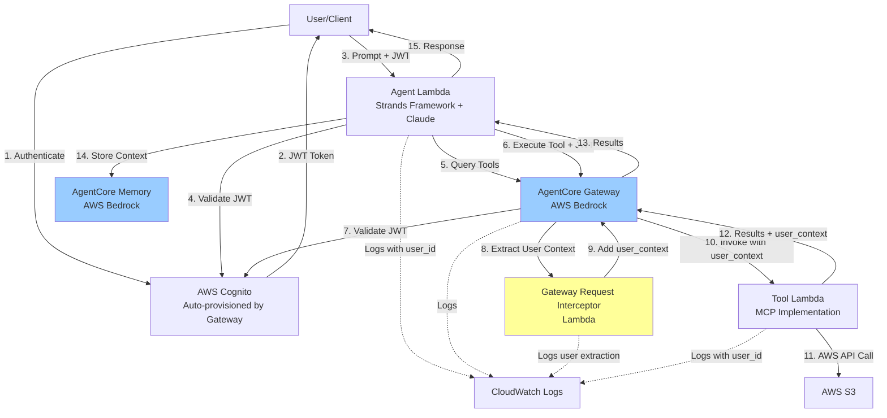
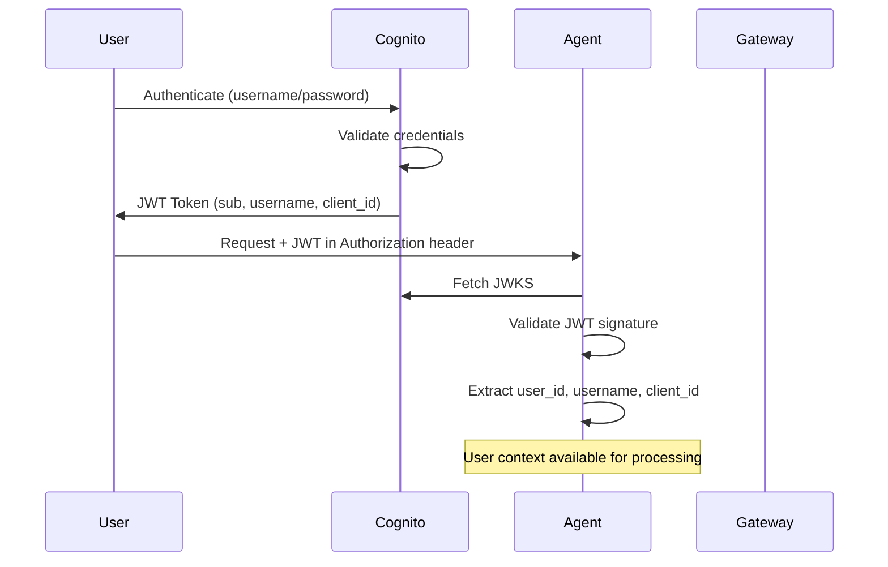
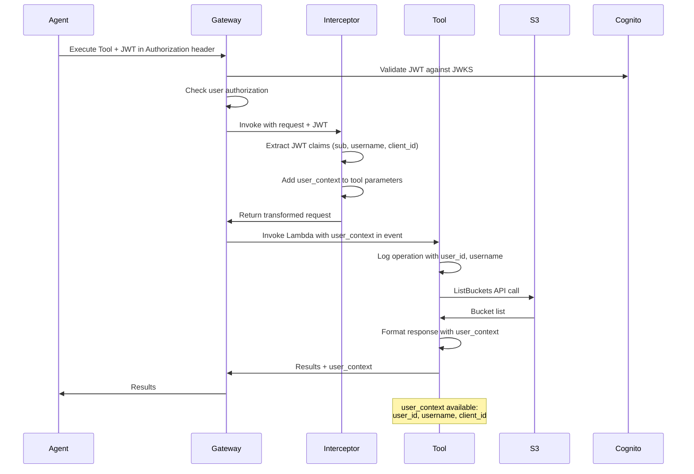
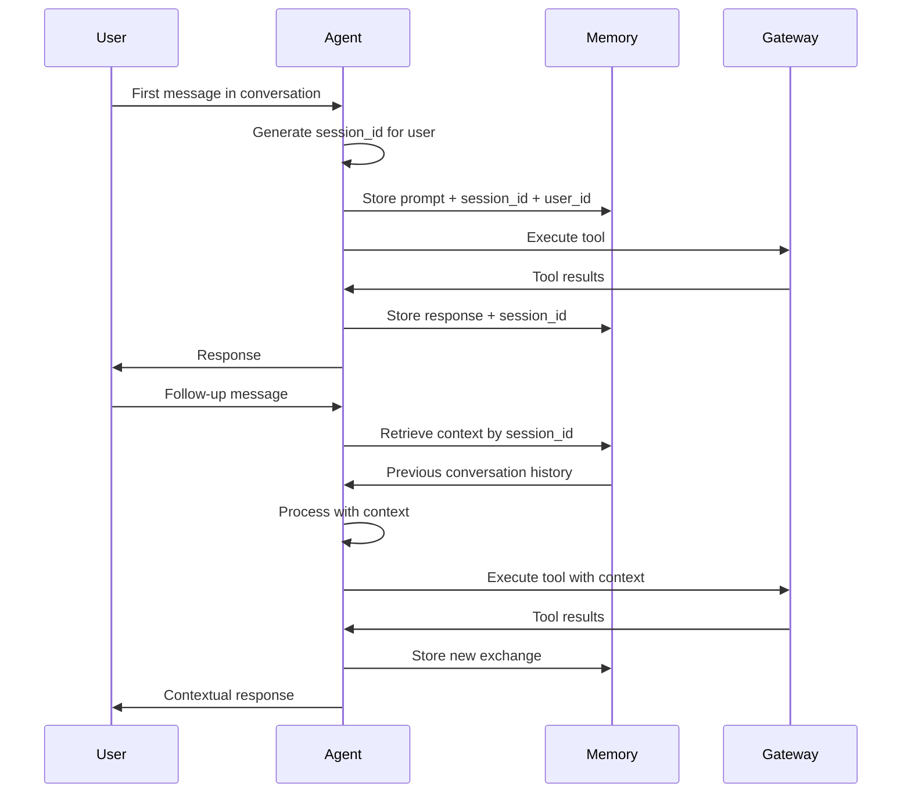

# Design Document: Serverless AI Agent Gateway

## Overview

This design describes a serverless AI agent system that enables natural language interaction with AWS services through a secure, multi-tenant architecture. The system demonstrates end-to-end user context propagation using AWS Bedrock AgentCore Gateway with Gateway Request Interceptors, ensuring complete user attribution at every layer including tool execution.

The architecture consists of five primary components:

1. **Agent Lambda**: Strands Framework-based AI agent that processes natural language using Claude 3 Sonnet via AWS Bedrock
2. **AgentCore Gateway**: AWS Bedrock service that mediates communication between the Agent and MCP tools, with auto-provisioned Cognito for authentication
3. **Gateway Request Interceptor**: Lambda function that extracts JWT claims and adds user context to tool parameters before forwarding to Tool Lambda
4. **Tool Lambda**: MCP tool implementation that executes AWS service operations with user attribution
5. **AgentCore Memory**: AWS Bedrock service providing persistent conversation context storage

The system uses CloudFormation for complete infrastructure-as-code deployment, enabling consistent provisioning across environments with a single command.

### Key Design Decisions

**Gateway Request Interceptor for User Context Propagation**: The system uses AgentCore Gateway's Request Interceptor feature to extract user identity from JWT tokens and inject user context into tool parameters. This ensures Tool Lambda receives user attribution without requiring the Agent to manually add user context to every tool call.

**No VPC Attachment**: Both Agent Lambda and Tool Lambda run without VPC attachment to enable direct access to Cognito JWKS endpoints and AWS services. This simplifies the architecture while maintaining security through IAM roles and JWT validation.

**Dual JWT Validation**: Both Agent Lambda and AgentCore Gateway independently validate JWT tokens against Cognito JWKS. This provides defense-in-depth security with validation at multiple layers.

**CloudFormation-First Approach**: All infrastructure is defined in CloudFormation templates, including AgentCore Gateway, AgentCore Memory, Lambda functions, IAM roles, and the Gateway Request Interceptor attachment. This enables reproducible deployments and infrastructure versioning.

**Session-Based Memory Management**: AgentCore Memory uses session identifiers tied to user identity to maintain conversation context across multiple interactions while ensuring multi-tenant isolation.

## Architecture

### System Architecture Diagram



### Authentication Flow



### Tool Execution Flow with Gateway Interceptor



### Memory Integration Flow



## Components and Interfaces

### Agent Lambda

**Purpose**: Orchestrates AI-powered natural language processing using the Strands Framework and Claude 3 Sonnet via AWS Bedrock.

**Responsibilities**:
- Validate incoming JWT tokens using Cognito JWKS
- Extract user context (user_id, username, client_id) from JWT claims
- Process natural language prompts using Claude 3 Sonnet
- Query AgentCore Gateway for available tools
- Pass tool definitions to Claude for AI-driven tool selection
- Execute selected tools through AgentCore Gateway with JWT token
- Manage conversation context using AgentCore Memory with session management
- Generate natural language responses from tool results
- Log all operations with user attribution

**Interface**:

```python
# Lambda handler signature
def lambda_handler(event: dict, context: LambdaContext) -> dict:
    """
    Process AI agent requests with user authentication.
    
    Args:
        event: {
            "headers": {
                "Authorization": "Bearer <jwt_token>"
            },
            "body": {
                "prompt": str,
                "session_id": Optional[str]
            }
        }
        context: AWS Lambda context
        
    Returns:
        {
            "statusCode": int,
            "body": {
                "response": str,
                "session_id": str,
                "user_context": {
                    "user_id": str,
                    "username": str,
                    "client_id": str
                }
            }
        }
    """
```

**Dependencies**:
- AWS Bedrock (Claude 3 Sonnet model)
- AgentCore Gateway (tool discovery and execution)
- AgentCore Memory (conversation context)
- AWS Cognito (JWT validation via JWKS)
- Strands Framework (agent orchestration)

**Configuration**:
- `COGNITO_JWKS_URL`: Cognito discovery URL for JWT validation
- `GATEWAY_ID`: AgentCore Gateway identifier
- `MEMORY_ID`: AgentCore Memory identifier
- `BEDROCK_MODEL_ID`: Claude model identifier (us.anthropic.claude-sonnet-4-6)
- `AWS_REGION`: Deployment region (us-east-1)

### AgentCore Gateway

**Purpose**: AWS Bedrock managed service that mediates communication between Agent and MCP tools, with auto-provisioned Cognito and Gateway Request Interceptor support.

**Responsibilities**:
- Auto-provision Cognito User Pool with OAuth2 configuration
- Validate JWT tokens independently against Cognito JWKS
- Check user authorization for gateway access
- Invoke Gateway Request Interceptor to add user context
- Route tool execution requests to appropriate Lambda targets
- Implement MCP protocol (JSON-RPC 2.0) formatting
- Manage tool registration and discovery
- Handle tool execution retries for transient failures
- Log all gateway operations

**Interface**:

```python
# Gateway API (AWS SDK)
gateway_client = boto3.client('bedrock-agent-runtime')

# Query available tools
response = gateway_client.list_tools(
    gatewayId='gateway-id',
    headers={
        'Authorization': 'Bearer <jwt_token>'
    }
)

# Execute tool
response = gateway_client.invoke_tool(
    gatewayId='gateway-id',
    toolName='list-s3-buckets',
    parameters={},  # Interceptor will add user_context
    headers={
        'Authorization': 'Bearer <jwt_token>'
    }
)
```

**Configuration** (CloudFormation):
- Gateway name and description
- Cognito auto-provisioning settings (generates access tokens for authorization)
- Authorization configuration using Cognito access tokens
- Gateway Request Interceptor Lambda ARN
- Gateway targets (Lambda MCP tools) defined using inline schema
- IAM execution role for invoking targets and interceptor
- Logging configuration

**Gateway Target Inline Schema**:

The Gateway Target is configured using an inline schema that defines the MCP tool interface directly in CloudFormation. This approach provides several benefits:
- Self-contained tool definition without external schema files
- Version control of tool schemas alongside infrastructure
- Simplified deployment with all configuration in one place
- Clear documentation of tool inputs and outputs

Example inline schema structure for the S3 list buckets tool:

```yaml
GatewayTarget:
  Type: AWS::BedrockAgent::GatewayTarget
  Properties:
    GatewayId: !Ref AgentCoreGateway
    TargetName: list-s3-buckets
    TargetType: LAMBDA
    LambdaArn: !GetAtt ToolLambda.Arn
    InlineSchema:
      type: object
      properties:
        toolName:
          type: string
          const: list-s3-buckets
        description:
          type: string
          const: Lists all S3 buckets in the account with creation dates
        parameters:
          type: object
          properties:
            user_context:
              type: object
              description: User identity information added by Gateway Interceptor
              properties:
                user_id:
                  type: string
                username:
                  type: string
                client_id:
                  type: string
        returns:
          type: object
          properties:
            buckets:
              type: array
              items:
                type: object
                properties:
                  name:
                    type: string
                  creation_date:
                    type: string
            user_context:
              type: object
              properties:
                user_id:
                  type: string
                username:
                  type: string
```

The inline schema serves multiple purposes:
1. **Tool Discovery**: Agent Lambda queries the Gateway to discover available tools and their schemas
2. **Parameter Validation**: Gateway validates tool parameters against the schema before invocation
3. **Documentation**: Schema provides self-documenting API for tool consumers
4. **Type Safety**: Schema enforces type constraints on inputs and outputs

### Gateway Request Interceptor Lambda

**Purpose**: Extract user identity from JWT tokens and inject user context into tool parameters before forwarding to Tool Lambda.

**Responsibilities**:
- Receive gateway requests from AgentCore Gateway
- Extract JWT token from Authorization header
- Decode JWT payload to extract user claims (sub, username, client_id)
- Add user_context to tool parameters in request body
- Return transformed request to gateway
- Handle errors gracefully without breaking request flow
- Log all operations for audit

**Interface**:

```python
def lambda_handler(event: dict, context: LambdaContext) -> dict:
    """
    Gateway Request Interceptor that adds user context to tool parameters.
    
    Args:
        event: {
            "headers": {
                "Authorization": "Bearer <jwt_token>"
            },
            "body": {
                "toolName": str,
                "parameters": dict
            }
        }
        context: AWS Lambda context
        
    Returns:
        {
            "body": {
                "toolName": str,
                "parameters": {
                    ...original_parameters,
                    "user_context": {
                        "user_id": str,
                        "username": str,
                        "client_id": str
                    }
                }
            }
        }
    """
```

**Error Handling**:
- If JWT extraction fails: Return original request unchanged, log error
- If JWT decoding fails: Return original request unchanged, log error
- If user claims missing: Return original request with partial context, log warning

**Configuration**:
- `LOG_LEVEL`: Logging verbosity
- `AWS_REGION`: Deployment region

### Tool Lambda (MCP Implementation)

**Purpose**: Execute AWS service operations using MCP protocol with user attribution.

**Responsibilities**:
- Receive tool execution requests from AgentCore Gateway
- Extract user_context from event payload (added by Interceptor)
- Execute AWS service operations using boto3
- Include user attribution in all operations and logs
- Format responses according to MCP protocol
- Handle AWS service errors gracefully
- Log all operations with user_id and username

**Interface**:

```python
def lambda_handler(event: dict, context: LambdaContext) -> dict:
    """
    MCP tool that lists S3 buckets with user attribution.
    
    Args:
        event: {
            "toolName": "list-s3-buckets",
            "parameters": {
                "user_context": {
                    "user_id": str,
                    "username": str,
                    "client_id": str
                }
            }
        }
        context: AWS Lambda context
        
    Returns:
        {
            "result": {
                "buckets": [
                    {
                        "name": str,
                        "creation_date": str
                    }
                ],
                "user_context": {
                    "user_id": str,
                    "username": str
                }
            }
        }
    """
```

**Tool Registry**:
- `list-s3-buckets`: List all S3 buckets with creation dates
- Extensible to support additional AWS services

**Multi-Tool Routing Strategy**:

When AgentCore Gateway invokes a Lambda target, it only passes the `arguments` from the MCP request, not the tool name. This presents a challenge for supporting multiple tools. Several architectural options exist:

**Option A: One Lambda Per Tool**
- Create a separate Lambda function for each Gateway Target
- Each Lambda is dedicated to a single tool
- Tool name is implicit from the Lambda's purpose
- Pros: Simple, clear separation of concerns, easy to manage permissions per tool
- Cons: More Lambda functions to manage, potential cold start overhead

**Option B: Environment Variable Configuration** (IMPLEMENTED)
- Single Lambda with `TOOL_NAME` environment variable
- CloudFormation creates multiple Lambda functions from same code with different env vars
- Tool routing based on environment variable
- Pros: Shared code, explicit configuration, no hardcoding
- Cons: Still requires multiple Lambda functions

**Option C: Lambda Function Tags**
- Use Lambda resource tags to identify tool(s) the function handles
- Lambda reads its own tags at runtime to determine routing
- Pros: Metadata-driven, flexible
- Cons: Runtime overhead to fetch tags, less explicit

**Option D: Gateway Event Analysis**
- Research if Gateway provides tool identifier in event payload
- Extract tool name from Gateway-specific event fields
- Pros: Most scalable, single Lambda for all tools
- Cons: Depends on Gateway behavior, may not be available

**Current Implementation**: The system uses Option B (Environment Variable Configuration). Each Lambda function has a `TOOL_NAME` environment variable that explicitly identifies which tool it handles. This provides:
- No hardcoded tool names in the code
- Explicit configuration in CloudFormation
- Shared code across all tool implementations
- Easy to add new tools by creating new Lambda functions with different `TOOL_NAME` values

**Adding New Tools**: To add a new tool:
1. Create a new Lambda function in CloudFormation with `TOOL_NAME` environment variable set to the new tool name
2. Create a new Gateway Target pointing to the new Lambda
3. Implement the tool logic in `src/tool/handler.py` tool registry
4. No changes needed to `ToolRequest.from_event()` - it reads from environment variable

**Configuration**:
- `LOG_LEVEL`: Logging verbosity
- `AWS_REGION`: Deployment region
- `TOOL_NAME`: (Optional) Explicit tool name if using Option B

### AgentCore Memory

**Purpose**: AWS Bedrock managed service providing persistent conversation context storage with session management.

**Responsibilities**:
- Store conversation history (prompts and responses)
- Associate memory with user identity and session identifiers
- Retrieve relevant context for ongoing conversations
- Implement multi-tenant isolation
- Manage session lifecycle and timeouts
- Integrate with AgentCore Gateway for context-aware tool execution

**Interface**:

```python
# Memory API (AWS SDK)
memory_client = boto3.client('bedrock-agent-runtime')

# Store conversation turn
memory_client.put_memory(
    memoryId='memory-id',
    sessionId='session-123',
    userId='user-456',
    content={
        'prompt': 'List my S3 buckets',
        'response': 'You have 3 S3 buckets...',
        'timestamp': '2024-01-15T10:30:00Z'
    }
)

# Retrieve conversation context
response = memory_client.get_memory(
    memoryId='memory-id',
    sessionId='session-123',
    userId='user-456'
)
```

**Configuration** (CloudFormation):
- Memory name and description
- Session timeout policy
- Context size limits
- IAM permissions for Agent Lambda access

### AWS Cognito (Auto-Provisioned)

**Purpose**: User authentication and JWT access token issuance, automatically created by AgentCore Gateway.

**Responsibilities**:
- User registration and authentication
- Issue JWT access tokens with user claims (sub, username, client_id)
- Provide JWKS endpoint for token validation
- Manage OAuth2 flows
- Handle token expiration and refresh

**Access Token Usage**:

The system uses Cognito access tokens (not ID tokens) for authorization with AgentCore Gateway. Access tokens are specifically designed for API authorization and contain the necessary claims for user identification:

- **Token Type**: Access token (`token_use: "access"`)
- **Authorization**: Presented in the `Authorization: Bearer <access_token>` header
- **Validation**: Both Agent Lambda and AgentCore Gateway validate access tokens using JWKS
- **Claims**: Contains `sub` (user_id), `username`, and `client_id` for user context propagation

**JWT Access Token Structure**:

```json
{
  "sub": "user-uuid",
  "username": "john.doe",
  "client_id": "app-client-id",
  "token_use": "access",
  "scope": "openid profile",
  "auth_time": 1705315800,
  "iss": "https://cognito-idp.us-east-1.amazonaws.com/us-east-1_XXXXX",
  "exp": 1705319400,
  "iat": 1705315800
}
```

**JWKS Endpoint**:
- URL: `https://cognito-idp.{region}.amazonaws.com/{user_pool_id}/.well-known/jwks.json`
- Used by Agent Lambda and AgentCore Gateway for JWT validation

## Data Models

### User Context

Represents user identity information propagated through all system layers.

```python
@dataclass
class UserContext:
    """User identity information extracted from JWT token."""
    user_id: str        # JWT 'sub' claim
    username: str       # JWT 'username' claim
    client_id: str      # JWT 'client_id' claim
    
    def to_dict(self) -> dict:
        return {
            'user_id': self.user_id,
            'username': self.username,
            'client_id': self.client_id
        }
    
    @classmethod
    def from_jwt_claims(cls, claims: dict) -> 'UserContext':
        return cls(
            user_id=claims['sub'],
            username=claims['username'],
            client_id=claims['client_id']
        )
```

### Agent Request

Represents an incoming request to the Agent Lambda.

```python
@dataclass
class AgentRequest:
    """Request to Agent Lambda with authentication."""
    prompt: str
    jwt_token: str
    session_id: Optional[str] = None
    
    @classmethod
    def from_event(cls, event: dict) -> 'AgentRequest':
        headers = event.get('headers', {})
        body = json.loads(event.get('body', '{}'))
        
        auth_header = headers.get('Authorization', '')
        jwt_token = auth_header.replace('Bearer ', '')
        
        return cls(
            prompt=body['prompt'],
            jwt_token=jwt_token,
            session_id=body.get('session_id')
        )
```

### Agent Response

Represents the response from Agent Lambda.

```python
@dataclass
class AgentResponse:
    """Response from Agent Lambda."""
    response: str
    session_id: str
    user_context: UserContext
    
    def to_lambda_response(self) -> dict:
        return {
            'statusCode': 200,
            'body': json.dumps({
                'response': self.response,
                'session_id': self.session_id,
                'user_context': self.user_context.to_dict()
            })
        }
```

### Tool Request

Represents a tool execution request with user context.

```python
@dataclass
class ToolRequest:
    """Tool execution request with user attribution."""
    tool_name: str
    parameters: dict
    user_context: UserContext
    
    @classmethod
    def from_event(cls, event: dict) -> 'ToolRequest':
        tool_name = event['toolName']
        parameters = event.get('parameters', {})
        user_context_dict = parameters.get('user_context', {})
        
        user_context = UserContext(
            user_id=user_context_dict.get('user_id', 'unknown'),
            username=user_context_dict.get('username', 'unknown'),
            client_id=user_context_dict.get('client_id', 'unknown')
        )
        
        return cls(
            tool_name=tool_name,
            parameters=parameters,
            user_context=user_context
        )
```

### Tool Response

Represents a tool execution response with user attribution.

```python
@dataclass
class ToolResponse:
    """Tool execution response with user attribution."""
    result: dict
    user_context: UserContext
    
    def to_dict(self) -> dict:
        return {
            'result': {
                **self.result,
                'user_context': {
                    'user_id': self.user_context.user_id,
                    'username': self.user_context.username
                }
            }
        }
```

### Conversation Context

Represents conversation history stored in AgentCore Memory.

```python
@dataclass
class ConversationTurn:
    """Single turn in a conversation."""
    prompt: str
    response: str
    timestamp: str
    tool_calls: List[dict] = field(default_factory=list)

@dataclass
class ConversationContext:
    """Complete conversation context for a session."""
    session_id: str
    user_id: str
    turns: List[ConversationTurn]
    created_at: str
    updated_at: str
    
    def to_memory_format(self) -> dict:
        return {
            'sessionId': self.session_id,
            'userId': self.user_id,
            'turns': [
                {
                    'prompt': turn.prompt,
                    'response': turn.response,
                    'timestamp': turn.timestamp,
                    'toolCalls': turn.tool_calls
                }
                for turn in self.turns
            ],
            'createdAt': self.created_at,
            'updatedAt': self.updated_at
        }
```

### Gateway Interceptor Request

Represents the request received by Gateway Request Interceptor.

```python
@dataclass
class InterceptorRequest:
    """Request to Gateway Request Interceptor."""
    jwt_token: str
    tool_name: str
    parameters: dict
    
    @classmethod
    def from_event(cls, event: dict) -> 'InterceptorRequest':
        headers = event.get('headers', {})
        body = event.get('body', {})
        
        auth_header = headers.get('Authorization', '')
        jwt_token = auth_header.replace('Bearer ', '')
        
        return cls(
            jwt_token=jwt_token,
            tool_name=body.get('toolName', ''),
            parameters=body.get('parameters', {})
        )
```

### Gateway Interceptor Response

Represents the transformed request returned by Gateway Request Interceptor.

```python
@dataclass
class InterceptorResponse:
    """Transformed request from Gateway Request Interceptor."""
    tool_name: str
    parameters: dict  # Now includes user_context
    
    def to_dict(self) -> dict:
        return {
            'body': {
                'toolName': self.tool_name,
                'parameters': self.parameters
            }
        }
```


## Correctness Properties

*A property is a characteristic or behavior that should hold true across all valid executions of a system—essentially, a formal statement about what the system should do. Properties serve as the bridge between human-readable specifications and machine-verifiable correctness guarantees.*

### Property Reflection

After analyzing all acceptance criteria, several properties were identified as redundant or overlapping:

- **User context propagation** (3.6, 4.5, 5.6): These all describe the same behavior - the Interceptor adding user_context to parameters. Consolidated into Property 4.
- **User context in Tool Lambda** (3.7, 5.8): Both describe Tool Lambda receiving user_context. Consolidated into Property 5.
- **User attribution in responses** (6.3, 6.4): Both about including user context in responses. Consolidated into Property 11.
- **Logging with user context** (3.9, 7.2, 7.5, 7.6): Multiple properties about logging user context at different layers. Consolidated into Property 14.
- **JWT validation** (1.4, 9.2): Same validation behavior. Consolidated into Property 1.
- **JWT claim extraction** (3.1, 3.5, 4.4, 9.4): All describe extracting user claims from JWT. Consolidated into Property 2.
- **Error handling in Interceptor** (4.7, 10.3, 10.8): All describe the same error handling behavior. Consolidated into Property 8.
- **Retry logic** (5.10, 10.4): Same retry behavior. Consolidated into Property 10.

The following properties provide unique validation value and form the complete correctness specification:

### Property 1: JWT Token Validation

*For any* JWT token presented to Agent Lambda, if the token has a valid signature from Cognito JWKS, the validation should succeed; if the token has an invalid signature, is expired, or is malformed, the validation should fail and return an appropriate error.

**Validates: Requirements 1.4, 1.6, 1.7, 9.2**

### Property 2: JWT Claims Extraction

*For any* valid JWT token containing `sub`, `username`, and `client_id` claims, extracting user identity should produce a UserContext object with user_id equal to `sub`, username equal to `username`, and client_id equal to `client_id`.

**Validates: Requirements 1.3, 3.1, 3.5, 4.4, 9.4**

### Property 3: User Context Preservation

*For any* UserContext object flowing through the system layers (Agent → Gateway → Interceptor → Tool), the user_id, username, and client_id values should remain unchanged at every layer.

**Validates: Requirements 3.2, 3.8, 9.8**

### Property 4: Gateway Interceptor Parameter Transformation

*For any* tool request received by the Gateway Request Interceptor with a valid JWT token, the transformed request returned by the Interceptor should include the original parameters plus a `user_context` field containing user_id, username, and client_id extracted from the JWT.

**Validates: Requirements 3.6, 4.5, 4.6, 5.6**

### Property 5: Tool Lambda User Context Receipt

*For any* Tool Lambda invocation, the event payload should contain a `user_context` field with non-empty user_id and username values (not "unknown").

**Validates: Requirements 3.7, 3.10, 5.8, 7.9**

### Property 6: Authorization Header Propagation

*For any* Agent Lambda invocation of AgentCore Gateway, the request should include an Authorization header containing the JWT token in the format "Bearer <token>".

**Validates: Requirements 3.3, 4.3**

### Property 7: MCP Protocol Formatting

*For any* tool execution request sent to AgentCore Gateway, the message format should conform to JSON-RPC 2.0 specification with required fields: jsonrpc, method, params, and id.

**Validates: Requirements 5.2**

### Property 8: Interceptor Error Handling

*For any* error encountered by the Gateway Request Interceptor (JWT extraction failure, decoding failure, missing claims), the Interceptor should return the original request unchanged and log the error without throwing an exception.

**Validates: Requirements 4.7, 10.3, 10.8**

### Property 9: Tool Response Parsing

*For any* MCP tool response in valid JSON-RPC 2.0 format, parsing should extract the result field successfully; for any malformed response, parsing should fail gracefully with an error message.

**Validates: Requirements 5.9**

### Property 10: Transient Failure Retry

*For any* tool execution that fails with a transient error (timeout, throttling, temporary unavailability), the system should retry the operation up to the configured maximum retry count before returning an error.

**Validates: Requirements 5.10, 10.4**

### Property 11: User Attribution in Responses

*For any* tool response, the result should include a `user_context` field containing the user_id and username of the requesting user.

**Validates: Requirements 6.3, 6.4**

### Property 12: AWS Service Error Handling

*For any* AWS service operation that fails (S3, Bedrock, etc.), the system should catch the exception, log it with user context, and return a descriptive error message without exposing sensitive information.

**Validates: Requirements 6.7, 10.5**

### Property 13: Session Management

*For any* conversation, when a user starts a new conversation, a unique session_id should be generated and associated with the user's user_id; for any subsequent request with that session_id, the conversation context should be retrieved from AgentCore Memory.

**Validates: Requirements 2.8, 12.1, 12.3**

### Property 14: Audit Logging with User Context

*For any* operation at any layer (Agent, Interceptor, Tool), a log entry should be created that includes timestamp, request_id, and user_context (user_id, username, client_id) when available.

**Validates: Requirements 3.9, 7.1, 7.2, 7.4, 7.5, 7.6**

### Property 15: Sensitive Information Protection in Logs

*For any* log entry, sensitive information (JWT tokens, passwords, full JWT payloads) should not appear in plaintext; only non-sensitive claims (user_id, username) should be logged.

**Validates: Requirements 7.8, 9.10**

### Property 16: Authentication Error Security

*For any* authentication failure, the error response should provide a generic error message without exposing details about why authentication failed (e.g., "user not found" vs "invalid password").

**Validates: Requirements 10.1**

### Property 17: Agent Error Handling

*For any* error encountered during Agent processing (Bedrock errors, Gateway errors, parsing errors), the system should log the error with user context and return a user-friendly message that doesn't expose internal implementation details.

**Validates: Requirements 10.2**

### Property 18: Gateway Unreachable Handling

*For any* AgentCore Gateway invocation that fails due to network issues or service unavailability, the Agent should catch the exception, log it, and return an error message to the user indicating the service is temporarily unavailable.

**Validates: Requirements 10.6**

### Property 19: External Service Timeout

*For any* external service call (Bedrock, Gateway, Memory, AWS services), a timeout should be configured; if the call exceeds the timeout, it should fail with a timeout error rather than hanging indefinitely.

**Validates: Requirements 10.7**

### Property 20: MCP Tool Interface Compliance

*For any* MCP tool implementation, it should accept a ToolRequest with tool_name, parameters, and user_context, and return a ToolResponse with result and user_context, following the standard interface pattern.

**Validates: Requirements 11.2**

### Property 21: Gateway Interceptor Target Type Compatibility

*For any* Gateway target type (Lambda, MCP Server, API Gateway, OpenAPI, Smithy), the Gateway Request Interceptor should successfully extract JWT claims and add user_context to the request parameters.

**Validates: Requirements 11.7**

### Property 22: Memory Multi-Tenant Isolation

*For any* memory storage or retrieval operation, the operation should be scoped to the user_id from the user context, ensuring that users can only access their own conversation history.

**Validates: Requirements 12.6**

### Property 23: Session Timeout

*For any* session, if no activity occurs for longer than the configured timeout period, subsequent requests with that session_id should either create a new session or return an error indicating the session has expired.

**Validates: Requirements 12.7**

### Property 24: Context Size Limiting

*For any* conversation context retrieval from AgentCore Memory, the returned context should be limited to a maximum size (number of turns or token count) to prevent performance degradation and excessive token usage.

**Validates: Requirements 12.8**

### Property 25: CloudFormation Idempotence

*For any* CloudFormation stack, deploying the same template twice should result in the same infrastructure state, with the second deployment either making no changes or only updating changed resources.

**Validates: Requirements 8.14**

## Error Handling

The system implements comprehensive error handling at every layer to ensure resilience and provide clear feedback to users.

### Agent Lambda Error Handling

**JWT Validation Errors**:
- Invalid signature: Return 401 Unauthorized with message "Invalid authentication token"
- Expired token: Return 401 Unauthorized with message "Authentication token expired"
- Malformed token: Return 401 Unauthorized with message "Invalid authentication token"
- Missing claims: Return 401 Unauthorized with message "Invalid authentication token"

**Bedrock Errors**:
- Throttling: Implement exponential backoff retry (up to 3 attempts)
- Model errors: Log error with user context, return "AI service temporarily unavailable"
- Timeout: Return "Request timed out, please try again"

**Gateway Errors**:
- Connection errors: Log error, return "Service temporarily unavailable"
- Timeout: Return "Request timed out, please try again"
- Invalid response: Log error, return "Unexpected service response"

**Memory Errors**:
- Storage failure: Log error, continue processing (degrade gracefully)
- Retrieval failure: Log error, proceed without context
- Timeout: Log error, proceed without context

**General Error Pattern**:
```python
try:
    # Operation
    result = perform_operation()
except SpecificException as e:
    logger.error(
        "Operation failed",
        extra={
            "error": str(e),
            "user_id": user_context.user_id,
            "username": user_context.username,
            "request_id": request_id
        }
    )
    return error_response("User-friendly message")
```

### Gateway Request Interceptor Error Handling

**JWT Extraction Errors**:
- Missing Authorization header: Return original request, log warning
- Malformed Authorization header: Return original request, log warning
- Empty token: Return original request, log warning

**JWT Decoding Errors**:
- Invalid base64: Return original request, log error
- Invalid JSON: Return original request, log error
- Missing claims: Return original request with partial context, log warning

**Error Pattern**:
```python
def lambda_handler(event, context):
    try:
        # Extract and transform
        transformed_request = transform_request(event)
        return transformed_request
    except Exception as e:
        logger.error(
            "Interceptor error",
            extra={"error": str(e), "request_id": context.request_id}
        )
        # Return original request to avoid breaking flow
        return event
```

### Tool Lambda Error Handling

**AWS Service Errors**:
- AccessDenied: Return "Insufficient permissions for this operation"
- ServiceUnavailable: Retry with exponential backoff (up to 3 attempts)
- Throttling: Retry with exponential backoff (up to 3 attempts)
- ResourceNotFound: Return "Requested resource not found"
- Timeout: Return "AWS service request timed out"

**Parameter Validation Errors**:
- Missing user_context: Log warning, use "unknown" for user fields
- Invalid parameters: Return "Invalid request parameters"

**Error Pattern**:
```python
def lambda_handler(event, context):
    try:
        tool_request = ToolRequest.from_event(event)
        result = execute_tool(tool_request)
        return ToolResponse(result, tool_request.user_context).to_dict()
    except ClientError as e:
        error_code = e.response['Error']['Code']
        logger.error(
            f"AWS service error: {error_code}",
            extra={
                "user_id": tool_request.user_context.user_id,
                "username": tool_request.user_context.username,
                "error": str(e)
            }
        )
        return error_response(get_user_friendly_message(error_code))
```

### Retry Strategy

**Transient Errors** (retry with exponential backoff):
- Network timeouts
- Service throttling (429)
- Service unavailable (503)
- Connection errors

**Retry Configuration**:
- Maximum attempts: 3
- Initial delay: 1 second
- Backoff multiplier: 2
- Maximum delay: 10 seconds

**Non-Retryable Errors** (fail immediately):
- Authentication errors (401, 403)
- Invalid parameters (400)
- Resource not found (404)
- Internal errors (500)

### Timeout Configuration

| Service | Timeout | Rationale |
|---------|---------|-----------|
| Agent Lambda | 30s | Bedrock inference can take 10-20s |
| Tool Lambda | 10s | AWS API calls typically < 5s |
| Interceptor Lambda | 5s | Simple JWT processing |
| Bedrock API | 25s | Allow time for model inference |
| Gateway API | 20s | Tool execution + overhead |
| Memory API | 5s | Fast storage/retrieval |

## Testing Strategy

The system uses a dual testing approach combining unit tests for specific examples and edge cases with property-based tests for universal correctness properties.

### Property-Based Testing

**Framework**: Use `hypothesis` for Python property-based testing.

**Configuration**: Each property test runs a minimum of 100 iterations to ensure comprehensive input coverage.

**Test Tagging**: Each property test includes a comment referencing the design property:
```python
# Feature: serverless-ai-agent-gateway, Property 2: JWT Claims Extraction
@given(jwt_token=valid_jwt_tokens())
def test_jwt_claims_extraction(jwt_token):
    # Test implementation
```

**Property Test Coverage**:

1. **JWT Validation** (Property 1): Generate valid and invalid JWT tokens, verify validation behavior
2. **Claims Extraction** (Property 2): Generate JWTs with various claim combinations, verify extraction
3. **User Context Preservation** (Property 3): Generate user contexts, pass through mock layers, verify unchanged
4. **Interceptor Transformation** (Property 4): Generate tool requests, verify user_context added
5. **Tool Context Receipt** (Property 5): Generate tool events, verify user_context present
6. **Authorization Header** (Property 6): Generate Gateway requests, verify header format
7. **MCP Protocol** (Property 7): Generate tool requests, verify JSON-RPC 2.0 format
8. **Interceptor Errors** (Property 8): Generate error conditions, verify original request returned
9. **Response Parsing** (Property 9): Generate valid and invalid responses, verify parsing
10. **Retry Logic** (Property 10): Generate transient failures, verify retry attempts
11. **User Attribution** (Property 11): Generate tool responses, verify user_context included
12. **AWS Error Handling** (Property 12): Generate AWS errors, verify error messages
13. **Session Management** (Property 13): Generate conversation sequences, verify session handling
14. **Audit Logging** (Property 14): Generate operations, verify log entries
15. **Log Security** (Property 15): Generate log entries, verify no sensitive data
16. **Auth Error Security** (Property 16): Generate auth failures, verify generic messages
17. **Agent Errors** (Property 17): Generate Agent errors, verify user-friendly messages
18. **Gateway Unreachable** (Property 18): Generate Gateway failures, verify error handling
19. **Timeouts** (Property 19): Generate slow operations, verify timeout enforcement
20. **Tool Interface** (Property 20): Generate tool implementations, verify interface compliance
21. **Interceptor Compatibility** (Property 21): Generate different target types, verify Interceptor works
22. **Memory Isolation** (Property 22): Generate multi-user operations, verify isolation
23. **Session Timeout** (Property 23): Generate expired sessions, verify timeout behavior
24. **Context Limiting** (Property 24): Generate large contexts, verify size limits
25. **CloudFormation Idempotence** (Property 25): Deploy stack twice, verify same state

### Unit Testing

Unit tests focus on specific examples, integration points, and edge cases that complement property tests.

**Agent Lambda Unit Tests**:
- Successful authentication flow with valid JWT
- Prompt processing with tool selection
- Memory storage and retrieval
- Integration with Bedrock API
- Integration with Gateway API
- Error handling for specific error codes

**Gateway Request Interceptor Unit Tests**:
- Successful JWT extraction and transformation
- Missing Authorization header handling
- Malformed JWT handling
- Missing claims handling
- Integration with Gateway invocation

**Tool Lambda Unit Tests**:
- S3 ListBuckets execution
- User context extraction from event
- Response formatting with user attribution
- Specific AWS error codes (AccessDenied, Throttling)
- Integration with boto3 S3 client

**Infrastructure Tests**:
- CloudFormation template validation
- Resource creation verification
- IAM permission verification
- Gateway configuration verification
- Interceptor attachment verification

### Integration Testing

**End-to-End Flow**:
1. Authenticate user → receive JWT
2. Submit prompt with JWT → Agent processes
3. Agent queries Gateway → receives tool list
4. Agent executes tool → Gateway invokes Interceptor
5. Interceptor transforms request → Gateway invokes Tool
6. Tool executes AWS operation → returns results
7. Agent generates response → stores in Memory
8. Verify user context at every layer
9. Verify audit logs at every layer

**Multi-Turn Conversation**:
1. Start new conversation → verify session_id created
2. Submit first prompt → verify context stored
3. Submit follow-up prompt → verify context retrieved
4. Verify conversation coherence across turns

**Error Scenarios**:
1. Invalid JWT → verify 401 response
2. Expired JWT → verify 401 response
3. AWS service error → verify error handling
4. Gateway unavailable → verify error handling
5. Interceptor error → verify graceful degradation

### Test Environment

**Local Testing**:
- Use moto for AWS service mocking (S3, Bedrock, Cognito)
- Use localstack for local AWS environment
- Mock AgentCore Gateway and Memory APIs

**Integration Testing**:
- Deploy to dedicated test AWS account
- Use real AgentCore Gateway and Memory
- Use real Cognito for authentication
- Test with actual AWS services

**CI/CD Pipeline**:
1. Run unit tests on every commit
2. Run property tests on every commit
3. Run integration tests on pull requests
4. Deploy to test environment on merge to main
5. Run smoke tests in test environment
6. Deploy to production on manual approval

### Test Data Generation

**JWT Token Generation**:
```python
from hypothesis import strategies as st

@st.composite
def valid_jwt_tokens(draw):
    user_id = draw(st.uuids())
    username = draw(st.text(min_size=1, max_size=50))
    client_id = draw(st.uuids())
    
    claims = {
        'sub': str(user_id),
        'username': username,
        'client_id': str(client_id),
        'exp': int(time.time()) + 3600,
        'iat': int(time.time())
    }
    
    return create_jwt(claims, private_key)
```

**User Context Generation**:
```python
@st.composite
def user_contexts(draw):
    return UserContext(
        user_id=draw(st.uuids()).hex,
        username=draw(st.text(min_size=1, max_size=50)),
        client_id=draw(st.uuids()).hex
    )
```

**Tool Request Generation**:
```python
@st.composite
def tool_requests(draw):
    return ToolRequest(
        tool_name=draw(st.sampled_from(['list-s3-buckets'])),
        parameters=draw(st.dictionaries(st.text(), st.text())),
        user_context=draw(user_contexts())
    )
```

### Coverage Goals

- **Line Coverage**: Minimum 80% for all Lambda functions
- **Branch Coverage**: Minimum 75% for error handling paths
- **Property Coverage**: 100% of correctness properties tested
- **Integration Coverage**: All critical user flows tested end-to-end

### Continuous Testing

- Run property tests with increased iterations (1000+) nightly
- Run integration tests against test environment hourly
- Monitor test execution time and optimize slow tests
- Track flaky tests and investigate root causes
- Update tests when requirements or design changes

