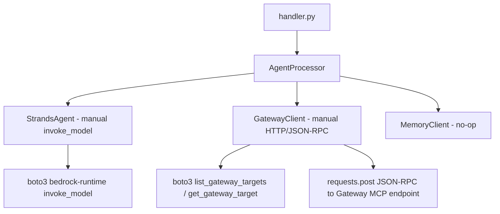
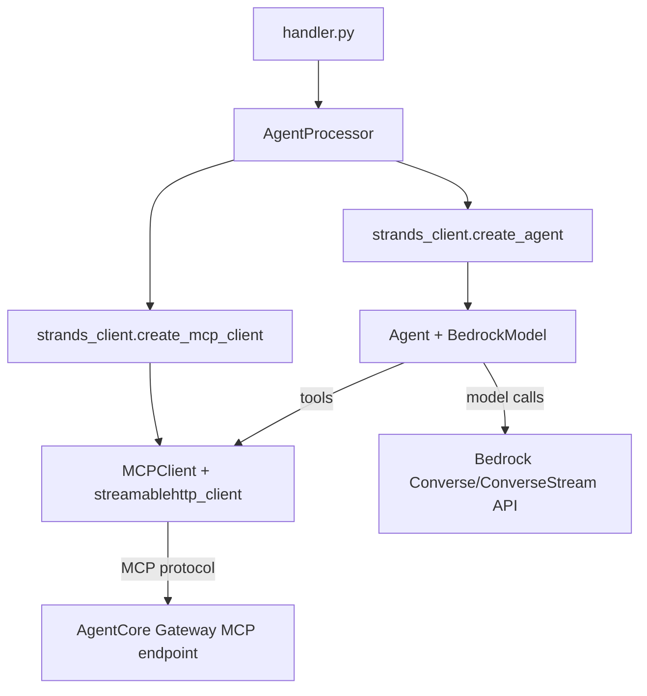
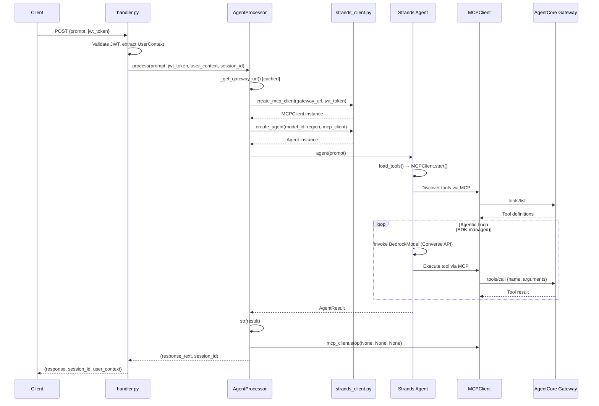

# Design Document: Strands SDK Migration

## Overview

This design covers migrating the Agent Lambda from a custom manual implementation (raw `boto3 invoke_model`, hand-rolled tool discovery via `list_gateway_targets`/`get_gateway_target`, manual JSON-RPC HTTP tool invocation, and a custom agentic loop) to the official `strands-agents` SDK. The SDK replaces all of this with three constructs: `BedrockModel` for model invocation, `MCPClient` with `streamablehttp_client` for tool discovery/execution via MCP protocol, and `Agent` for the autonomous agentic loop.

The migration scope is limited to the Agent Lambda internals (`handler.py`, `agent_processor.py`, `strands_client.py`), deletion of obsolete modules (`gateway_client.py`, `memory_client.py`), updates to the Agent Lambda's IAM role and resource configuration in CloudFormation, and dependency changes. Cognito, AgentCore Gateway, Gateway Targets, Interceptor Lambda, and Tool Lambda are untouched.

### Key Design Decisions

1. **Factory function pattern**: `strands_client.py` exposes `create_mcp_client()` and `create_agent()` factory functions rather than wrapper classes. This keeps the SDK surface thin and avoids re-wrapping SDK objects.

2. **Per-request MCPClient lifecycle**: A new `MCPClient` is created for each Lambda invocation because the JWT token (passed as an HTTP header to the Gateway) is request-specific. The Agent's `load_tools()` calls `start()` internally, so we must NOT use a `with` context manager (which would double-start). Cleanup is done via `mcp_client.stop(None, None, None)` in a `finally` block.

3. **Gateway URL caching**: The Gateway URL (retrieved via `get_gateway` control plane API) is cached at the `AgentProcessor` instance level. Since Lambda containers are reused across invocations, this avoids redundant API calls on warm starts.

4. **No memory integration**: The `MemoryClient` and `MEMORY_ID` environment variable are removed entirely. The agent operates statelessly.

5. **handler.py minimal changes**: The handler retains its JWT validation, request parsing, and response formatting. The only change is removing `MEMORY_ID` from environment variables and simplifying the `AgentProcessor` constructor call.

## Architecture

### Before (Current)



### After (Migrated)



### Request Flow



## Components and Interfaces

### strands_client.py — Factory Functions

This module replaces the current `StrandsAgent` class with two stateless factory functions and a system prompt constant.

```python
# Public API
SYSTEM_PROMPT: str  # Default system prompt for the agent

def create_mcp_client(gateway_url: str, jwt_token: str) -> MCPClient:
    """Create an MCPClient with streamablehttp_client transport.
    
    Args:
        gateway_url: AgentCore Gateway MCP endpoint URL
        jwt_token: Cognito access token for Authorization header
    
    Returns:
        Configured MCPClient (not yet started — Agent.load_tools() handles that)
    """

def create_agent(
    model_id: str,
    region: str,
    mcp_client: MCPClient,
    system_prompt: str | None = None
) -> Agent:
    """Create a Strands Agent with BedrockModel and MCPClient tool source.
    
    Args:
        model_id: Bedrock model ID (e.g., anthropic.claude-3-sonnet-20240229-v1:0)
        region: AWS region for Bedrock
        mcp_client: MCPClient instance for tool discovery/execution
        system_prompt: Optional override for SYSTEM_PROMPT
    
    Returns:
        Configured Agent ready to be called with a prompt
    """
```

### agent_processor.py — AgentProcessor

Simplified orchestrator that wires factory functions together per request.

```python
class AgentProcessor:
    """Orchestrates Strands Agent processing for each Lambda invocation."""
    
    def __init__(
        self,
        gateway_id: str,
        model_id: str,
        region: str,
        logger: StructuredLogger
    ):
        """Initialize processor. No memory_id parameter.
        
        Caches gateway_url across invocations within the same Lambda container.
        """
    
    def process(
        self,
        prompt: str,
        jwt_token: str,
        user_context: UserContext,
        session_id: str | None
    ) -> tuple[str, str]:
        """Process a user prompt through the Strands Agent.
        
        1. Generate session_id if not provided
        2. Get gateway URL (cached)
        3. Create MCPClient with jwt_token
        4. Create Agent with MCPClient
        5. Call agent(prompt)
        6. Return (str(result), session_id)
        7. Always stop MCPClient in finally block
        """
    
    def _get_gateway_url(self) -> str:
        """Retrieve and cache Gateway MCP endpoint URL via get_gateway API."""
```

### handler.py — Changes

Minimal changes:
- Remove `MEMORY_ID` environment variable reference
- Update `AgentProcessor` constructor call (drop `memory_id` parameter)
- Everything else (JWT validation, request parsing, response formatting, error handling) stays the same

### Deleted Modules

- `gateway_client.py` — All functionality replaced by `MCPClient`
- `memory_client.py` — No-op module, no longer needed

### CloudFormation Changes

Changes scoped to the `AgentLambda` resource and `AgentLambdaRole`:

| Resource | Change |
|---|---|
| `AgentLambdaRole` | Add `bedrock:Converse` and `bedrock:ConverseStream` actions |
| `AgentLambdaRole` | Remove `bedrock-agentcore:ListGatewayTargets` and `bedrock-agentcore:GetGatewayTarget` actions |
| `AgentLambda` | Timeout: 30s → 120s |
| `AgentLambda` | MemorySize: 512 MB → 1024 MB |
| `AgentLambda` | Remove `MEMORY_ID` environment variable |
| `AgentLambdaDurationAlarm` | Threshold: 25000ms → 100000ms |

### Dependency Changes (agent-requirements.txt)

| Action | Package |
|---|---|
| Add | `strands-agents>=1.0.0` |
| Add | `mcp>=1.0.0` |
| Keep | `boto3`, `PyJWT`, `cryptography` |
| Remove | `requests` |

## Data Models

No new data models are introduced. The existing `UserContext`, `AgentRequest`, `AgentResponse` dataclasses in `shared/models.py` are unchanged.

The Strands SDK introduces its own internal types:
- `strands.Agent` — The agent orchestrator, callable with a string prompt, returns an `AgentResult`
- `strands.models.bedrock.BedrockModel` — Wraps Bedrock Converse/ConverseStream API
- `strands.tools.mcp.MCPClient` — MCP tool source for the Agent
- `AgentResult` — Return value from `agent(prompt)`, convertible to string via `str(result)`

These are SDK types consumed as-is; we don't extend or wrap them. The only conversion point is `str(result)` to extract the text response for the Lambda response body.

### Data Flow

```
Lambda Event → AgentRequest (existing) → prompt string → Agent(prompt) → AgentResult → str() → AgentResponse (existing) → Lambda Response
```

The JWT token flows from `AgentRequest` through `AgentProcessor` into `create_mcp_client()` where it becomes the `Authorization: Bearer` header on the streamable HTTP transport. The Gateway validates this JWT and the Interceptor extracts user context from it — this flow is unchanged.


## Correctness Properties

*A property is a characteristic or behavior that should hold true across all valid executions of a system — essentially, a formal statement about what the system should do. Properties serve as the bridge between human-readable specifications and machine-verifiable correctness guarantees.*

### Property 1: Agent factory wiring

*For any* valid `model_id` string, `region` string, mock `MCPClient` instance, and optional `system_prompt` string, calling `create_agent(model_id, region, mcp_client, system_prompt)` should return an `Agent` instance whose `BedrockModel` is configured with the given `model_id`, `region_name`, and `max_tokens=4096`, whose tool sources include the provided `MCPClient`, and whose system prompt matches the provided value (or `SYSTEM_PROMPT` default when None).

**Validates: Requirements 1.1, 1.2, 1.3**

### Property 2: MCPClient factory transport configuration

*For any* `gateway_url` string and `jwt_token` string, calling `create_mcp_client(gateway_url, jwt_token)` should return an `MCPClient` instance configured with `streamablehttp_client` transport using the given URL and an `Authorization: Bearer {jwt_token}` header.

**Validates: Requirements 2.1, 2.2**

### Property 3: Per-request MCPClient lifecycle

*For any* sequence of `process()` calls on the same `AgentProcessor` instance with different JWT tokens, each call should create a new `MCPClient` instance (i.e., `create_mcp_client` is called once per `process()` invocation, never reusing a previous client).

**Validates: Requirements 3.1**

### Property 4: MCPClient cleanup on all paths

*For any* prompt processed by `AgentProcessor.process()`, whether the agent succeeds or raises an exception, `mcp_client.stop(None, None, None)` must be called exactly once. If `stop()` itself raises an exception, the original result or error must be preserved (not masked).

**Validates: Requirements 3.4, 3.5**

### Property 5: Agent invocation and result conversion

*For any* prompt string and any agent result object, `AgentProcessor.process()` should invoke the agent with the prompt via `agent(prompt)` and return `str(result)` as the response text.

**Validates: Requirements 4.1, 4.5**

### Property 6: Gateway URL caching

*For any* `AgentProcessor` instance, calling `process()` N times (N ≥ 1) should result in exactly one call to the `get_gateway` API. Subsequent invocations must reuse the cached Gateway URL.

**Validates: Requirements 4.2**

## Error Handling

### MCPClient Lifecycle Errors

The primary error handling concern is the MCPClient cleanup. The `finally` block in `AgentProcessor.process()` ensures `mcp_client.stop()` is always called:

```python
mcp_client = create_mcp_client(gateway_url, jwt_token)
try:
    agent = create_agent(self.model_id, self.region, mcp_client)
    result = agent(prompt)
    return str(result), session_id
finally:
    try:
        mcp_client.stop(None, None, None)
    except Exception:
        pass  # Suppress to avoid masking original error
```

### SDK-Level Errors

The Strands SDK handles retries and error propagation internally for:
- Bedrock API throttling and transient errors (via BedrockModel)
- MCP transport errors (via MCPClient)
- Tool execution failures (via the agentic loop)

SDK exceptions bubble up through `agent(prompt)` and are caught by the existing `try/except` in `handler.py`, which returns appropriate HTTP error responses via `ErrorHandler`.

### Gateway URL Retrieval Errors

If `get_gateway` fails, the error propagates up to the handler's error handling. This is acceptable because without a Gateway URL, no tools can be discovered and the request cannot proceed.

### Authentication Errors

No changes. JWT validation in `handler.py` remains identical. Authentication failures return 401 before reaching `AgentProcessor`.

## Testing Strategy

### Property-Based Testing

Use **Hypothesis** (`hypothesis` Python library) for property-based tests. Each property test must run a minimum of 100 iterations.

All six correctness properties should be implemented as property-based tests with mocked SDK dependencies (Agent, BedrockModel, MCPClient). The tests validate the wiring and lifecycle logic in `strands_client.py` and `agent_processor.py` without requiring real AWS services.

Tag format for each test: `# Feature: strands-sdk-migration, Property {N}: {title}`

Configuration:
```python
from hypothesis import given, settings, strategies as st

@settings(max_examples=100)
@given(
    model_id=st.text(min_size=1, max_size=100),
    region=st.text(min_size=1, max_size=30),
    system_prompt=st.one_of(st.none(), st.text(min_size=1, max_size=500))
)
def test_create_agent_wiring(model_id, region, system_prompt):
    # Feature: strands-sdk-migration, Property 1: Agent factory wiring
    ...
```

### Unit Testing

Unit tests complement property tests for specific examples and edge cases:

- **handler.py**: Verify `MEMORY_ID` is no longer referenced; verify `AgentProcessor` is constructed without `memory_id`
- **Static code checks**: Verify absence of `invoke_model`, `list_gateway_targets`, `get_gateway_target`, `requests.post`, `JSON-RPC` patterns in agent source files
- **File existence**: Verify `gateway_client.py` and `memory_client.py` do not exist in `src/agent/`
- **CloudFormation validation**: Verify IAM actions include `bedrock:Converse` and `bedrock:ConverseStream`; verify `MEMORY_ID` env var removed; verify timeout=120, memory=1024, alarm threshold=100000
- **Dependencies**: Verify `agent-requirements.txt` contains `strands-agents>=1.0.0` and `mcp>=1.0.0`, retains `boto3`/`PyJWT`/`cryptography`, and does not contain `requests`

### Test Organization

```
tests/
  test_strands_client.py    # Property tests for create_mcp_client, create_agent
  test_agent_processor.py   # Property tests for AgentProcessor lifecycle, caching, cleanup
  test_migration_checks.py  # Unit tests for static code checks, file existence, CloudFormation, dependencies
```
