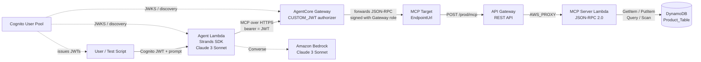
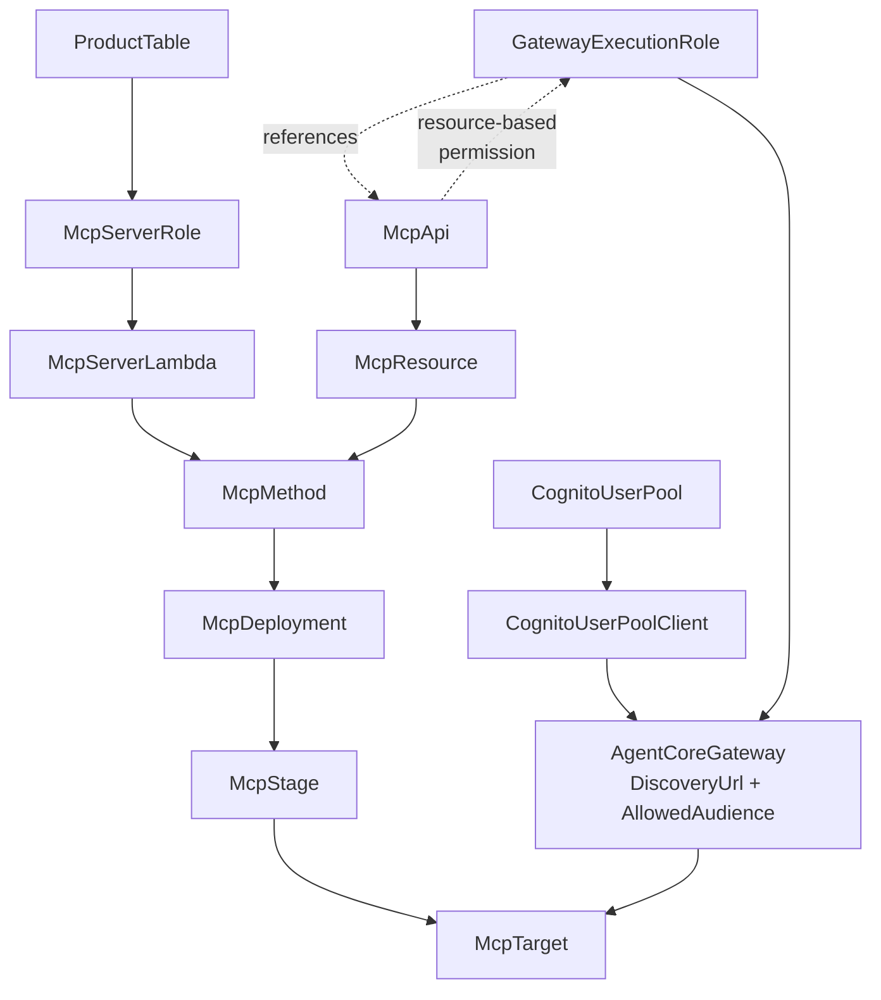
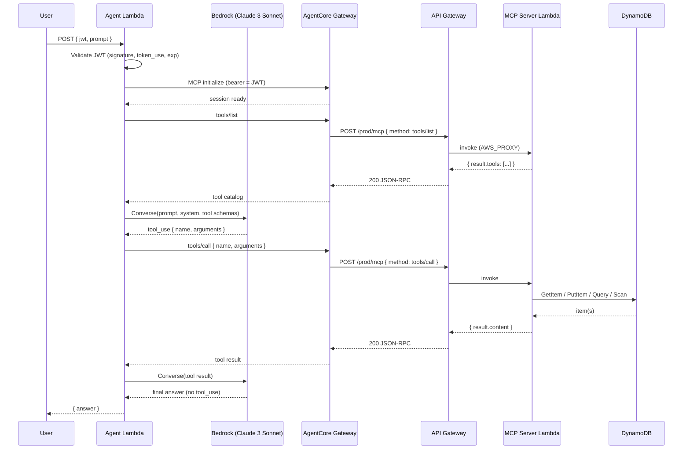
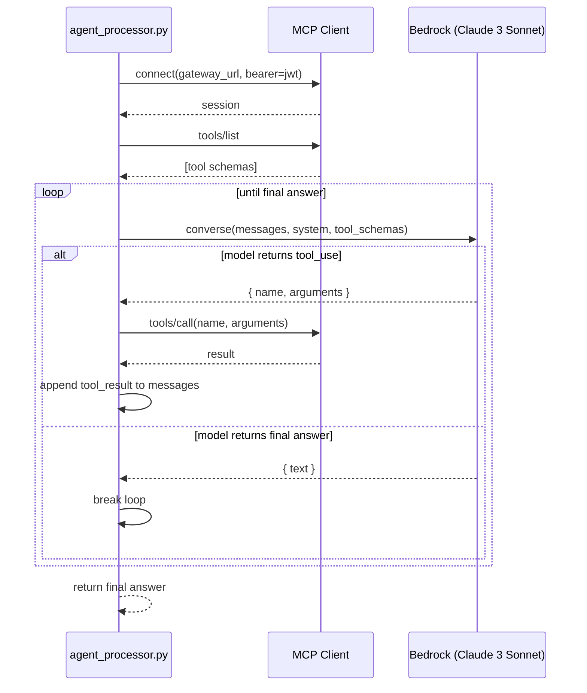

# Design Document

## Overview

This feature delivers a serverless AI agent that answers user prompts by invoking product-management tools exposed through AWS Bedrock AgentCore Gateway using an **MCP (Model Context Protocol) target type**. The agent is model-driven: Claude 3 Sonnet picks which tool to invoke from a catalog discovered at runtime — the Agent Lambda never hard-codes tool selection.

The architecture reuses authentication, agent runtime, and gateway patterns from the prior `strands-agentcore-smithy` project, but replaces the Smithy target with an MCP target. Because the MCP target type forwards MCP JSON-RPC requests to an HTTPS URL, a new HTTPS-accessible MCP server (API Gateway + Lambda + DynamoDB) is introduced.

Key design decisions:

- **API Gateway fronts the MCP Lambda** so AgentCore Gateway has a public HTTPS endpoint to forward JSON-RPC to. Lambda has no public HTTPS endpoint on its own.
- **`GATEWAY_IAM_ROLE` credential provider** — the Gateway uses its execution role to invoke API Gateway. No credential-provider CLI dance required.
- **Model-driven tool selection** — Strands SDK loops between Bedrock model turns and MCP tool calls until the model returns a final answer.
- **Reuse over rewrite** — `src/agent/` and `src/shared/` from `strands-agentcore-smithy` are target-type agnostic and are copied without modification except for a single system-prompt update.

## Architecture

### High-Level Component Diagram



Region: `us-east-1`. Every resource is provisioned by a single CloudFormation stack.

### Deployment-Time Resource Dependencies



Ordering rules (enforced by `DependsOn` or by property references):

1. `CognitoUserPool` before `CognitoUserPoolClient` before the Gateway authorizer configuration.
2. `ProductTable` before `McpServerRole` (the role's policy scopes to the table ARN).
3. `McpApi` → `McpResource` → `McpMethod` → `McpDeployment` → `McpStage` before `McpTarget` (the target's `EndpointUrl` references the deployed stage).
4. `GatewayExecutionRole` before `AgentCoreGateway` (`RoleArn`).
5. `AgentCoreGateway` before `McpTarget` (`GatewayIdentifier`).

### End-to-End Request Sequence



### Strands Agent Control Loop



The loop is orchestrated by the Strands SDK. The Agent Lambda's only job is to set up the MCP session, attach the JWT, and hand the tool-enabled agent the user prompt. The **model** picks tools from the discovered catalog.

## Components and Interfaces

### Agent Lambda (reused)

Files are copied without modification from `strands-agentcore-smithy`:

| File | Role |
|------|------|
| `src/agent/handler.py` | Lambda entry point: parses event, validates JWT, delegates to `agent_processor` |
| `src/agent/agent_processor.py` | Wraps Strands `Agent` with an MCP client session; the **only change** is `SYSTEM_PROMPT` |
| `src/agent/strands_client.py` | Factory for `BedrockModel` and `MCPClient` wired against the gateway URL |
| `src/shared/models.py` | Request/response dataclasses |
| `src/shared/jwt_utils.py` | JWKS-based JWT validation (accepts both `token_use` values, `verify_aud=False`) |
| `src/shared/error_utils.py` | Error envelope helpers |
| `src/shared/logging_utils.py` | Structured JSON logging |

Updated `SYSTEM_PROMPT`:

```python
SYSTEM_PROMPT = """You have access to product management tools via MCP.
- Use list_products to see available products (optionally filter by category)
- Use get_product with category and productId to retrieve a specific product
- Use put_product to create or update a product

Respond conversationally based on tool results."""
```

Handler path in CloudFormation: `src.agent.handler.lambda_handler` — the `src/` prefix is preserved in the zip.

### MCP Server Lambda (new)

Three modules under `src/mcp_server/`:

#### `handler.py`

Entry point called by API Gateway `AWS_PROXY`. Responsibilities:

1. Emit a structured log for the incoming request (method, request id).
2. Parse `event.body` as JSON-RPC 2.0. On parse failure, return `-32700`.
3. Dispatch by `method`:
   - `tools/list` → call `tools.list_tool_catalog()`
   - `tools/call` → call `tools.dispatch(params.name, params.arguments)`; on unknown tool return `-32601`; on argument-schema mismatch return `-32602`; on exception log and return `-32603`.
4. Always return HTTP 200 with `Content-Type: application/json` and a JSON-RPC-shaped body (including when the body is a JSON-RPC error object).

Response helper:

```python
def json_rpc_response(id_, result=None, error=None):
    body = {"jsonrpc": "2.0", "id": id_}
    if error is not None:
        body["error"] = error
    else:
        body["result"] = result
    return {
        "statusCode": 200,
        "headers": {"Content-Type": "application/json"},
        "body": json.dumps(body),
    }
```

#### `tools.py`

Declares the three tools, each as `(name, description, input_schema, handler)`:

```python
LIST_PRODUCTS = Tool(
    name="list_products",
    description="List products, optionally filtered by category.",
    input_schema={
        "type": "object",
        "properties": {"category": {"type": "string"}},
        "additionalProperties": False,
    },
    handler=lambda args: dynamodb_client.list_products(args.get("category")),
)

GET_PRODUCT = Tool(
    name="get_product",
    description="Get a product by category and productId.",
    input_schema={
        "type": "object",
        "properties": {
            "category": {"type": "string"},
            "productId": {"type": "string"},
        },
        "required": ["category", "productId"],
        "additionalProperties": False,
    },
    handler=lambda args: dynamodb_client.get_product(args["category"], args["productId"]),
)

PUT_PRODUCT = Tool(
    name="put_product",
    description="Create or update a product.",
    input_schema={
        "type": "object",
        "properties": {
            "category": {"type": "string"},
            "productId": {"type": "string"},
            "name": {"type": "string"},
            "price": {"type": "number"},
        },
        "required": ["category", "productId", "name", "price"],
        "additionalProperties": False,
    },
    handler=lambda args: dynamodb_client.put_product(args),
)

TOOLS = {t.name: t for t in [LIST_PRODUCTS, GET_PRODUCT, PUT_PRODUCT]}
```

`list_tool_catalog()` returns `{"tools": [t.public_dict() for t in TOOLS.values()]}` where `public_dict()` exposes `name`, `description`, and `inputSchema`.

`dispatch(name, arguments)` validates `arguments` against the tool's `input_schema` (jsonschema), then calls the handler. Validation failure raises `InvalidParamsError` → `-32602`.

#### `dynamodb_client.py`

Thin wrapper around `boto3.resource('dynamodb').Table(PRODUCT_TABLE)`:

- `list_products(category=None)` — `Query` when category provided, else `Scan`. Returns `Items` list.
- `get_product(category, productId)` — `GetItem`. Returns `{"found": False}` when missing, else `{"found": True, "item": <item>}`.
- `put_product(item)` — `PutItem(Item=item)`. Returns `{"written": True, "item": item}`.

All DynamoDB exceptions bubble up to `handler.py` which maps them to `-32603`.

### CloudFormation Template

Single file at `infrastructure/cloudformation-template.yaml`. Resource inventory:

| Logical Id | Type | Notes |
|------------|------|-------|
| `CognitoUserPool` | `AWS::Cognito::UserPool` | Standard username + password |
| `CognitoUserPoolClient` | `AWS::Cognito::UserPoolClient` | `ExplicitAuthFlows: [ALLOW_USER_PASSWORD_AUTH, ALLOW_REFRESH_TOKEN_AUTH]` |
| `ProductTable` | `AWS::DynamoDB::Table` | PK `category` (S), SK `productId` (S), `PAY_PER_REQUEST` |
| `McpServerRole` | `AWS::IAM::Role` | DynamoDB on `ProductTable.Arn` + CloudWatch Logs |
| `McpServerLambda` | `AWS::Lambda::Function` | Handler `src.mcp_server.handler.lambda_handler`, `Environment.PRODUCT_TABLE` |
| `McpApi` | `AWS::ApiGateway::RestApi` | Name `mcp-api` |
| `McpResource` | `AWS::ApiGateway::Resource` | Path part `mcp` under root |
| `McpMethod` | `AWS::ApiGateway::Method` | `POST`, `AuthorizationType: AWS_IAM`, `AWS_PROXY` integration |
| `McpDeployment` | `AWS::ApiGateway::Deployment` | `DependsOn: McpMethod` |
| `McpStage` | `AWS::ApiGateway::Stage` | StageName `prod` |
| `McpApiInvokePermission` | `AWS::Lambda::Permission` | API GW → Lambda invoke |
| `GatewayExecutionRole` | `AWS::IAM::Role` | 4 AgentCore ARN patterns + `execute-api:Invoke` on `McpApi` |
| `AgentCoreGateway` | `AWS::BedrockAgentCore::Gateway` | `AuthorizerConfiguration.CustomJWTAuthorizer` (all-caps JWT) |
| `McpTarget` | `AWS::BedrockAgentCore::GatewayTarget` | `TargetConfiguration.Mcp.McpServer.EndpointUrl` |
| `AgentLambdaRole` | `AWS::IAM::Role` | Bedrock `InvokeModel` + `bedrock-agentcore:InvokeGateway` + Logs |
| `AgentLambdaFunction` | `AWS::Lambda::Function` | Handler `src.agent.handler.lambda_handler`, env for gateway URL + Cognito |

Casing rules are enforced explicitly in the template and called out in inline comments:

- `AuthorizerConfiguration.CustomJWTAuthorizer` — all-caps `JWT`
- `RoleArn` (not `ExecutionRoleArn`) on the Gateway
- `AllowedAudience` (not `Audience`) under `CustomJWTAuthorizer`
- `CredentialProviderConfigurations` as an **array**
- `DiscoveryUrl` ends with `/.well-known/openid-configuration`

Stack outputs: `AgentLambdaName`, `CognitoUserPoolId`, `CognitoClientId`, `McpApiInvokeUrl`, `GatewayUrl` — consumed by `deploy.sh` when it generates `scripts/test.sh`.

## Data Models

### Product Item (DynamoDB)

| Attribute | Type | Role |
|-----------|------|------|
| `category` | String | Partition key |
| `productId` | String | Sort key |
| `name` | String | Product display name |
| `price` | Number | Product price |

Example:

```json
{
  "category": "Electronics",
  "productId": "ELEC-001",
  "name": "Noise-cancelling Headphones",
  "price": 199.99
}
```

Seeded by `deploy.sh` with at least three items across at least two categories (e.g. `Electronics/ELEC-001`, `Electronics/ELEC-002`, `Books/BOOK-001`).

### MCP JSON-RPC Request

```json
{
  "jsonrpc": "2.0",
  "id": "<string | number>",
  "method": "tools/list" | "tools/call",
  "params": { ... }
}
```

- `tools/list` takes no params.
- `tools/call` params: `{ "name": "<tool>", "arguments": { ... } }`.

### MCP JSON-RPC Response

Success:

```json
{
  "jsonrpc": "2.0",
  "id": "<same as request>",
  "result": { ... }
}
```

Error:

```json
{
  "jsonrpc": "2.0",
  "id": "<same as request>",
  "error": { "code": <int>, "message": "<string>", "data"?: { ... } }
}
```

Error codes used: `-32700` parse, `-32601` method not found, `-32602` invalid params, `-32603` internal.

### Tool Catalog Entry (`tools/list` result)

```json
{
  "name": "get_product",
  "description": "Get a product by category and productId.",
  "inputSchema": {
    "type": "object",
    "properties": {
      "category": {"type": "string"},
      "productId": {"type": "string"}
    },
    "required": ["category", "productId"],
    "additionalProperties": false
  }
}
```

### JWT Claims Consumed

| Claim | Usage |
|-------|-------|
| `iss` | JWKS lookup |
| `kid` (header) | Key selection within JWKS |
| `exp` | Expiry check |
| `token_use` | Must be `access` or `id` |
| `cognito:username` | Authenticated username |

## IAM Role Design

### Gateway Execution Role

Trust policy: `bedrock-agentcore.amazonaws.com`.

Inline policies:

- **AgentCoreAccess** — `bedrock-agentcore:*` scoped to the four ARN patterns:
  - `token-vault/default`
  - `token-vault/default/apikeycredentialprovider/*`
  - `workload-identity-directory/default`
  - `workload-identity-directory/default/workload-identity/{gateway-name}-*`
- **InvokeMcpApi** — `execute-api:Invoke` on `arn:aws:execute-api:{region}:{account}:{McpApi}/*/*/*`

No wildcard `*` on all AWS resources.

### MCP Server Lambda Role

Trust policy: `lambda.amazonaws.com`.

Inline policies:

- **DynamoDBAccess** — `dynamodb:GetItem | PutItem | Query | Scan` scoped to `ProductTable.Arn` only.
- **CloudWatchLogs** — `logs:CreateLogGroup | CreateLogStream | PutLogEvents`.

### Agent Lambda Role

Trust policy: `lambda.amazonaws.com`.

Inline policies:

- **BedrockInvoke** — `bedrock:InvokeModel` on the Claude 3 Sonnet model ARN.
- **AgentCoreInvoke** — `bedrock-agentcore:InvokeGateway` on the Gateway ARN.
- **CloudWatchLogs** — standard logging.


## Correctness Properties

*A property is a characteristic or behavior that should hold true across all valid executions of a system — essentially, a formal statement about what the system should do. Properties serve as the bridge between human-readable specifications and machine-verifiable correctness guarantees.*

The properties below were derived by analyzing every acceptance criterion in `requirements.md` (see the prework analysis). Criteria classified as SMOKE, INTEGRATION, or EXAMPLE are covered by non-PBT tests described in the Testing Strategy section. Criteria classified as PROPERTY are consolidated here after redundancy reflection.

### Property 1: JWT validation positive path

*For any* JWT signed by the Cognito User Pool with a non-expired `exp`, a `token_use` claim in `{access, id}`, and a `cognito:username` claim, JWT validation SHALL succeed and the extracted username SHALL equal the value of the `cognito:username` claim.

**Validates: Requirements 1.3, 1.4, 1.6**

### Property 2: JWT validation negative path

*For any* JWT that is missing, has an invalid signature, is expired, or has a `token_use` claim outside `{access, id}`, the Agent Lambda SHALL return an authentication error response AND SHALL NOT invoke AgentCore Gateway.

**Validates: Requirements 1.3, 1.4, 1.7**

### Property 3: Registered tool-call dispatch

*For any* registered MCP tool and any arguments that satisfy the tool's `inputSchema`, the MCP Server Lambda's handler SHALL return a JSON-RPC 2.0 success response whose `result.content` field is populated from the tool's execution.

**Validates: Requirements 6.1, 6.3**

### Property 4: Malformed JSON-RPC request error codes

*For any* HTTP request body that is not a valid JSON-RPC 2.0 request, the MCP Server Lambda SHALL return a JSON-RPC error response with code `-32700`; *for any* `tools/call` request naming a tool that is not in the registered tool catalog, the MCP Server Lambda SHALL return a JSON-RPC error response with code `-32601`.

**Validates: Requirements 6.4, 6.5**

### Property 5: Invalid tool arguments

*For any* `tools/call` request whose `params.arguments` fails JSON Schema validation against the named tool's declared `inputSchema`, the MCP Server Lambda SHALL return a JSON-RPC error response with code `-32602`.

**Validates: Requirements 7.6**

### Property 6: HTTP envelope invariant

*For any* input received by the MCP Server Lambda via API Gateway — whether a valid JSON-RPC request, an invalid body, or a tool-execution failure — the HTTP response SHALL have `statusCode == 200` and `Content-Type == application/json`.

**Validates: Requirements 6.6**

### Property 7: JSON-RPC response round-trip

*For any* MCP JSON-RPC response object produced by the MCP Server Lambda (success or error), `json.loads(json.dumps(response))` SHALL equal the original response object.

**Validates: Requirements 6.7**

### Property 8: list_products filtering correctness

*For any* state of `ProductTable` and *for any* optional `category` argument, the items returned by `list_products` SHALL be exactly the set of items whose `category` attribute matches the argument, or all items when no `category` argument is provided.

**Validates: Requirements 7.1**

### Property 9: put/get round-trip

*For any* valid product item `p` with required fields `category`, `productId`, `name`, and `price`, calling `put_product(p)` followed by `get_product(p.category, p.productId)` SHALL return an item equal to `p`.

**Validates: Requirements 7.2, 7.4, 7.7**

### Property 10: put_product overwrite

*For any* two product items `A` and `B` sharing the same `category` and `productId` values, calling `put_product(A)` followed by `put_product(B)` followed by `get_product(A.category, A.productId)` SHALL return an item equal to `B`.

**Validates: Requirements 7.5**

## Error Handling

Errors are classified by layer; each layer has a well-defined response shape that callers can rely on.

### Authentication Errors (Agent Lambda)

| Condition | Response |
|-----------|----------|
| Missing `Authorization` header | HTTP 401 with `{ "error": "unauthorized", "message": "missing token" }` |
| Malformed / unparseable JWT | HTTP 401 with `{ "error": "unauthorized", "message": "invalid token" }` |
| Signature verification failure | HTTP 401 with `{ "error": "unauthorized", "message": "invalid signature" }` |
| Expired token | HTTP 401 with `{ "error": "unauthorized", "message": "token expired" }` |
| `token_use` not in `{access, id}` | HTTP 401 with `{ "error": "unauthorized", "message": "invalid token_use" }` |

In all of the above, the Gateway is **not** invoked (Property 2).

### Gateway Connectivity Errors (Agent Lambda)

| Condition | Response |
|-----------|----------|
| MCP session cannot be established | HTTP 502 with `{ "error": "gateway_unavailable", "message": "..." }` |
| Gateway returns 401/403 | HTTP 502 with `{ "error": "gateway_forbidden", "message": "..." }` |
| Gateway times out | HTTP 504 with `{ "error": "gateway_timeout", "message": "..." }` |

All gateway-layer errors are logged via `logging_utils` with the user id and request id correlated.

### JSON-RPC Errors (MCP Server Lambda)

Every error path returns HTTP 200 (Property 6) with a JSON-RPC error body:

| Condition | Code | Message |
|-----------|------|---------|
| Body not parseable as JSON-RPC 2.0 | `-32700` | `parse error` |
| `method` is not `tools/list` or `tools/call`, or `tools/call` names an unknown tool | `-32601` | `method not found: <method>` or `unknown tool: <name>` |
| `tools/call` arguments fail `inputSchema` validation | `-32602` | `invalid params: <details>` |
| Tool handler raises an unexpected exception | `-32603` | `internal error: <exception summary>` (details logged, not returned) |

### DynamoDB Errors (MCP Server Lambda)

All `botocore` / `boto3` exceptions raised by `dynamodb_client.py` are caught in `handler.py` and surface as `-32603` internal errors. The full stack trace is logged with the request id; only a summary is returned to the caller. This prevents information leakage while preserving debuggability.

Special cases:

- `get_product` on a non-existent key is **not** a DynamoDB error — `GetItem` with a missing key returns an empty response, which `dynamodb_client.get_product` converts to `{"found": false}` and returns as a successful tool result (Requirement 7.3).

## Testing Strategy

A dual approach combines property-based tests for universal behaviors with example / integration / smoke tests for everything else.

### Test Taxonomy

| Type | Where | Count | Iterations |
|------|-------|-------|------------|
| **Property-based** (PBT) | `tests/property/` | 10 (one per Correctness Property) | ≥100 per test |
| **Unit / example** | `tests/unit/` | ~20 | 1 each |
| **Template assertions** | `tests/unit/test_template.py` | ~25 | 1 each |
| **Integration** | `tests/integration/` | 3–5 | 1 each |
| **Smoke** | `scripts/test.sh` + post-deploy | 3 | 1 each |

### Property-Based Testing

- **Library**: [`hypothesis`](https://hypothesis.readthedocs.io/) for Python. No bespoke PBT implementation.
- **Iterations**: each property test runs at least 100 iterations (`@settings(max_examples=100)` or higher).
- **Tagging**: each property test is prefixed with a comment `# Feature: strands-agentcore-mcp, Property {number}: {property text}` so failures trace back to the design.
- **Generators**:
  - JWT generator: builds signed JWTs with configurable claims using a test RSA keypair and a mocked JWKS endpoint.
  - Product generator: `@st.composite` combining `category` (small alphabet), `productId` (UUID-shaped), `name` (unicode text), `price` (non-negative Decimal).
  - JSON-RPC request generator: produces both well-formed and malformed bodies, including edge cases (empty string, `"null"`, array bodies, missing `jsonrpc` field).
  - Tool-arguments generator: per-tool, generates arguments matching and violating each tool's `inputSchema`.
- **Scope**: property tests target the pure logic layer with mocked boundaries:
  - `jwt_utils` is tested against a mock JWKS.
  - MCP server dispatch is tested against an in-memory DynamoDB stub (`moto` or a hand-rolled stub).
  - The DynamoDB round-trip property (P9) runs against `moto` in a pytest fixture.

### Unit / Example Tests

Cover acceptance criteria classified as EXAMPLE:

- `SYSTEM_PROMPT` contents include all three tool names.
- `tools/list` response has exactly three tools with required fields and the correct `inputSchema`.
- Agent loop ordering: `tools/list` is called before the first Bedrock `converse` (mock-based).
- `verify_aud=False` is passed to `jwt.decode` (mock-based).
- Tool-execution exception produces `-32603` and logs the exception.
- CloudWatch log entry shape for each request (method, tool name when applicable).

### Template Assertion Tests

A single `test_template.py` parses `infrastructure/cloudformation-template.yaml` and asserts the casing / configuration requirements from Requirements 3, 4, 5, 8, 9, 10, and 12. Examples:

- `AuthorizerConfiguration.CustomJWTAuthorizer` exists (all-caps `JWT`).
- `RoleArn` present, `ExecutionRoleArn` absent on the Gateway.
- `AllowedAudience` present, `Audience` absent.
- `CredentialProviderConfigurations` is a list.
- `DiscoveryUrl` endswith `/.well-known/openid-configuration`.
- `GatewayExecutionRole` has the four AgentCore ARN patterns and the `execute-api:Invoke` statement, and no wildcard `*`.
- `McpServerRole` DynamoDB resource equals `ProductTable.Arn` only.
- `ProductTable` billing mode is `PAY_PER_REQUEST`; keys are `category` (S) and `productId` (S).
- `McpMethod` uses `AWS_PROXY` integration to `McpServerLambda`.

### Integration Tests

Run against a deployed stack in `us-east-1`:

1. **End-to-end happy path** — authenticate via Cognito, POST a prompt, receive a conversational answer grounded in seeded products.
2. **Unauthorized** — request without JWT → 401/403 at the Gateway.
3. **MCP list** — authenticated request that triggers a `tools/list` plus at least one `tools/call` (verified via CloudWatch Logs Insights query over both Lambdas).

### Smoke Tests

Post-deploy checks executed by `deploy.sh` on successful stack create/update:

- Cognito test user exists and is `CONFIRMED`.
- `ProductTable` scan returns ≥3 items across ≥2 categories.
- `GET /prod/mcp` returns 403 (proving API Gateway is up and requiring IAM auth).

### CI Script Lints

`tests/unit/test_deploy_script.py` greps `scripts/deploy.sh` for:

- Two `pip3 install` invocations with `--platform manylinux2014_x86_64` and `--python-version 3.12`.
- Absence of `rm .*dist-info` patterns.
- Presence of case-insensitive `DOES_NOT_EXIST` match.
- Presence of `ROLLBACK_COMPLETE` + `delete-stack` + `aws cloudformation wait`.
- No bare `pip ` invocations (only `pip3`).
- `/tmp/*.$$.*` temp-file pattern; no `mktemp -t` suffix templates.
- `aws cloudformation validate-template` appears before any other AWS CLI call.

### Deployment Design

Single CloudFormation stack named `agentcore-mcp` deployed by `scripts/deploy.sh` in this order:

1. **Validate** — `aws cloudformation validate-template`.
2. **Package Agent Lambda** — two-step `pip3` install into a temp dir, zip with `src/` prefix preserved.
3. **Package MCP Server Lambda** — identical two-step install, zip with `src/` prefix preserved.
4. **Stack create or update** — case-insensitive `DOES_NOT_EXIST` match; if `ROLLBACK_COMPLETE`, delete and wait before recreating.
5. **Update Lambda code** — `update-function-code` against both Lambdas (or S3 reference when the zip exceeds 50 MB).
6. **Seed `ProductTable`** — three sample products across two categories.
7. **Create Cognito test user** — `admin-create-user` followed by `admin-set-user-password` with `--permanent`.
8. **Generate `scripts/test.sh`** — with deployment outputs (User Pool id, Client id, Agent Lambda name) baked in as literal strings; default prompt baked in; `$1` override supported.

Temp files follow the `/tmp/agentcore-mcp.$$.<purpose>` PID-based pattern for macOS compatibility. All AWS CLI calls target `us-east-1`.

### Test Script Contract

`scripts/test.sh` is regenerated on every successful deploy. It:

- Authenticates against Cognito with the test user and captures the ID token.
- Invokes the Agent Lambda with `{ "jwt": "<id_token>", "prompt": "<arg or default>" }`.
- Prints the model's final answer.

Default prompt: `"List all products."` — exercises `tools/list` and the `list_products` tool in a single end-to-end call.
