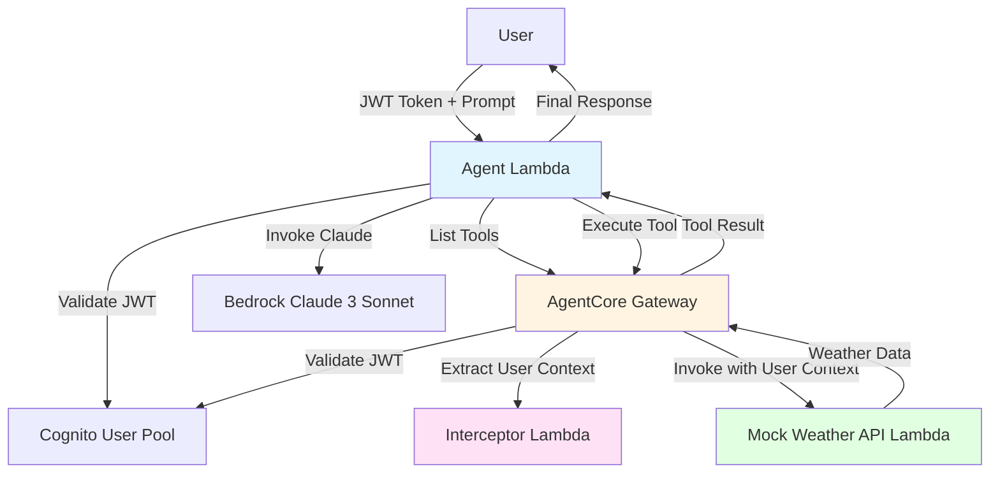

# Design Document: OpenAPI Agent Gateway

## Overview

The OpenAPI Agent Gateway is a serverless AI agent system that dynamically discovers and invokes REST API operations from OpenAPI 3.x specifications. The system extends the proven Strands Framework architecture from strands-reference, replacing hardcoded tool definitions with runtime OpenAPI parsing and tool generation.

The architecture consists of three Lambda functions orchestrated through AWS Bedrock AgentCore Gateway:

1. **Agent Lambda** (512MB, 30s timeout): Processes natural language prompts using Claude 3 Sonnet, discovers tools from OpenAPI specifications via the Gateway, and orchestrates tool execution
2. **Interceptor Lambda** (128MB, 5s timeout): Extracts user identity from Cognito JWT tokens and injects user context into API requests for complete audit trails
3. **Mock Weather API Lambda** (256MB, 10s timeout): Demonstrates the OpenAPI integration pattern with getCurrentWeather and getForecast operations

The system uses Cognito JWT authentication, AgentCore Gateway for tool mediation, and CloudFormation for infrastructure deployment in us-east-1. The OpenAPI parser generates Gateway Target resources dynamically, enabling the pattern to extend to any OpenAPI-compliant API without code changes.

## Architecture

### System Components



### Three-Layer Agent Lambda Architecture

The Agent Lambda follows the Strands Framework pattern with clear separation of concerns:

```
handler.py (Entry Point)
├── JWT validation and user context extraction
├── Request/response formatting
└── Error handling and logging

agent_processor.py (Orchestration)
├── Session management
├── Tool discovery coordination
├── Claude invocation orchestration
└── Tool execution coordination

strands_client.py + gateway_client.py (Clients)
├── StrandsAgent: Claude/Bedrock interactions
└── GatewayClient: Tool discovery and execution
```

### Data Flow

1. **Authentication Flow**: User obtains JWT from Cognito → Agent Lambda validates JWT → Gateway validates JWT on tool invocation
2. **Tool Discovery Flow**: Agent Lambda → Gateway list_gateway_targets() → Parse OpenAPI-generated targets → Convert to Claude format
3. **Tool Invocation Flow**: Claude selects tool → Agent Lambda invokes via Gateway MCP endpoint → Gateway calls Interceptor → Interceptor adds user_context → Gateway invokes Weather API → Results return through chain

### OpenAPI Integration Pattern

The system parses OpenAPI 3.x specifications to generate Gateway Target resources:

```
OpenAPI Specification
└── Operations (paths + methods)
    ├── operationId → Tool Name
    ├── summary → Tool Description
    ├── parameters → Input Schema
    ├── requestBody → Input Schema
    └── responses → Output Schema
```

Each operation becomes a Gateway Target with inline tool schema, enabling Claude to discover and invoke the operation through the Gateway's MCP protocol.

## Components and Interfaces

### 1. Agent Lambda

**Purpose**: Orchestrate AI agent processing with Claude 3 Sonnet

**Key Classes**:
- `handler.lambda_handler(event, context)`: Entry point with JWT validation
- `AgentProcessor`: Orchestrates tool discovery, Claude invocation, and tool execution
- `StrandsAgent`: Wraps Bedrock Claude 3 Sonnet API
- `GatewayClient`: Discovers and invokes tools through AgentCore Gateway

**Environment Variables**:
- `COGNITO_JWKS_URL`: Cognito JWKS endpoint for JWT validation
- `GATEWAY_ID`: AgentCore Gateway identifier
- `BEDROCK_MODEL_ID`: Claude model ID (anthropic.claude-3-sonnet-20240229-v1:0)
- `AWS_REGION`: AWS region (us-east-1)
- `LOG_LEVEL`: Logging level (INFO)

**Input Event**:
```json
{
  "headers": {
    "Authorization": "Bearer <jwt_token>"
  },
  "body": {
    "prompt": "What's the weather in Seattle?",
    "session_id": "optional-session-id"
  }
}
```

**Output Response**:
```json
{
  "statusCode": 200,
  "body": {
    "response": "The current weather in Seattle is...",
    "session_id": "session-id",
    "user_context": {
      "user_id": "user-123",
      "username": "user@example.com",
      "client_id": "client-456"
    }
  }
}
```

**Key Methods**:

`GatewayClient.list_tools(jwt_token) -> List[Dict]`:
- Calls `list_gateway_targets()` API to retrieve all Gateway Targets
- For each target, calls `get_gateway_target()` to retrieve tool schema
- Converts tool definitions to Claude format with three-underscore naming: `{TargetName}___{ToolName}`
- Returns list of Claude-compatible tool definitions

`GatewayClient.invoke_tool(tool_name, tool_input, jwt_token) -> Dict`:
- Gets Gateway MCP endpoint URL via `get_gateway()` API
- Formats JSON-RPC 2.0 request: `{"jsonrpc": "2.0", "method": "tools/call", "params": {"name": tool_name, "arguments": tool_input}, "id": request_id}`
- Sends HTTPS POST to Gateway MCP endpoint with JWT in Authorization header
- Gateway validates JWT, invokes Interceptor, then invokes target Lambda
- Returns tool execution result

`StrandsAgent.invoke_with_tools(messages, tools, system_prompt) -> Dict`:
- Formats request for Claude API with messages, tools, and system prompt
- Invokes Bedrock `invoke_model()` with model ID and request body
- Returns Claude response with tool_use blocks or text response

### 2. Interceptor Lambda

**Purpose**: Extract user identity from JWT and inject into tool arguments

**Key Function**:
- `handler.lambda_handler(event, context)`: Extracts JWT claims and adds user_context to tool arguments

**Environment Variables**:
- `LOG_LEVEL`: Logging level (INFO)

**Input Event** (from Gateway):
```json
{
  "mcp": {
    "gatewayRequest": {
      "body": {
        "jsonrpc": "2.0",
        "method": "tools/call",
        "params": {
          "name": "weather-api___getCurrentWeather",
          "arguments": {
            "location": "Seattle"
          }
        },
        "id": "request-id"
      },
      "headers": {
        "Authorization": "Bearer <jwt_token>"
      }
    }
  }
}
```

**Output Response**:
```json
{
  "interceptorOutputVersion": "1.0",
  "mcp": {
    "transformedGatewayRequest": {
      "body": {
        "jsonrpc": "2.0",
        "method": "tools/call",
        "params": {
          "name": "weather-api___getCurrentWeather",
          "arguments": {
            "location": "Seattle",
            "user_context": {
              "user_id": "user-123",
              "username": "user@example.com",
              "client_id": "client-456"
            }
          }
        },
        "id": "request-id"
      }
    }
  }
}
```

**Key Logic**:
- Decode JWT payload (without verification, Gateway already validated)
- Extract claims: `sub` → user_id, `username` → username, `client_id` → client_id
- Inject user_context into arguments
- Return transformed request or original request if extraction fails

### 3. Mock Weather API Lambda

**Purpose**: Demonstrate OpenAPI integration pattern with weather operations

**Key Function**:
- `handler.lambda_handler(event, context)`: Validates user_context and returns mock weather data

**Environment Variables**:
- `LOG_LEVEL`: Logging level (INFO)

**Operations**:

`getCurrentWeather(location: str, user_context: dict) -> dict`:
- Validates user_context presence
- Returns current weather data for location
- Logs user_id for audit trail

`getForecast(location: str, days: int, user_context: dict) -> dict`:
- Validates user_context presence
- Returns forecast data for location and days
- Logs user_id for audit trail

**Input Event** (from Gateway after Interceptor):
```json
{
  "location": "Seattle",
  "user_context": {
    "user_id": "user-123",
    "username": "user@example.com",
    "client_id": "client-456"
  }
}
```

**Output Response**:
```json
{
  "location": "Seattle",
  "temperature": 65,
  "conditions": "Partly Cloudy",
  "humidity": 70,
  "wind_speed": 10,
  "user_context": {
    "user_id": "user-123",
    "username": "user@example.com"
  }
}
```

### 4. OpenAPI Parser

**Purpose**: Parse OpenAPI 3.x specifications and generate tool definitions

**Key Module**: `openapi_parser.py`

**Key Functions**:

`parse_openapi_spec(spec_dict: dict) -> List[ToolDefinition]`:
- Validates OpenAPI version (3.0.x or 3.1.x)
- Extracts all operations from paths
- Converts each operation to tool definition
- Returns list of tool definitions

`extract_operation_tool(path: str, method: str, operation: dict) -> ToolDefinition`:
- Extracts operationId or generates from method + path
- Extracts summary for description
- Converts parameters to input schema
- Converts requestBody to input schema
- Converts responses to output schema
- Returns ToolDefinition

`convert_to_json_schema(openapi_schema: dict) -> dict`:
- Converts OpenAPI schema to JSON Schema format
- Handles OpenAPI-specific keywords (nullable, discriminator)
- Returns JSON Schema compatible with Claude

**Data Model**:
```python
@dataclass
class ToolDefinition:
    name: str
    description: str
    input_schema: dict
    output_schema: dict
    security: List[dict]
```

### 5. CloudFormation Template Generator

**Purpose**: Generate Gateway Target resources from OpenAPI specifications

**Key Function**:

`generate_gateway_targets(openapi_spec: dict, gateway_id: str, lambda_arn: str) -> List[dict]`:
- Parses OpenAPI specification
- For each operation, creates Gateway Target resource
- Configures Lambda target with tool schema
- Returns list of CloudFormation resource definitions

**Gateway Target Structure**:
```yaml
Type: AWS::BedrockAgentCore::GatewayTarget
Properties:
  GatewayIdentifier: !Ref AgentCoreGateway
  Name: weather-api
  Description: Weather API operations
  TargetConfiguration:
    Mcp:
      Lambda:
        LambdaArn: !GetAtt WeatherAPILambda.Arn
        ToolSchema:
          InlinePayload:
            - Name: getCurrentWeather
              Description: Get current weather for a location
              InputSchema:
                Type: object
                Properties:
                  location:
                    Type: string
                  user_context:
                    Type: object
              OutputSchema:
                Type: object
```

## Data Models

### UserContext

```python
@dataclass
class UserContext:
    user_id: str      # From JWT 'sub' claim
    username: str     # From JWT 'username' claim
    client_id: str    # From JWT 'client_id' claim
```

### AgentRequest

```python
@dataclass
class AgentRequest:
    prompt: str
    jwt_token: str
    session_id: Optional[str] = None
```

### AgentResponse

```python
@dataclass
class AgentResponse:
    response: str
    session_id: str
    user_context: UserContext
```

### ToolDefinition

```python
@dataclass
class ToolDefinition:
    name: str                    # operationId or {method}_{path}
    description: str             # From operation summary
    input_schema: dict           # JSON Schema from parameters + requestBody
    output_schema: dict          # JSON Schema from responses
    security: List[dict]         # Security requirements
```

### OpenAPISpec

```python
@dataclass
class OpenAPISpec:
    openapi: str                 # Version (3.0.x or 3.1.x)
    info: dict                   # API metadata
    paths: dict                  # API operations
    components: dict             # Reusable schemas
    security: List[dict]         # Global security requirements
```

### WeatherData

```python
@dataclass
class WeatherData:
    location: str
    temperature: float
    conditions: str
    humidity: int
    wind_speed: float
    user_context: UserContext
```

### ForecastData

```python
@dataclass
class ForecastData:
    location: str
    days: int
    forecast: List[DailyForecast]
    user_context: UserContext

@dataclass
class DailyForecast:
    date: str
    high: float
    low: float
    conditions: str
```


## Correctness Properties

A property is a characteristic or behavior that should hold true across all valid executions of a system-essentially, a formal statement about what the system should do. Properties serve as the bridge between human-readable specifications and machine-verifiable correctness guarantees.

### Property 1: OpenAPI Operation Extraction Completeness

For any valid OpenAPI 3.x specification, parsing the specification should extract tool definitions for all operations defined in the paths section, where each tool definition includes the operation's name, description, input schema, and output schema.

**Validates: Requirements 2.1, 2.2, 2.3, 2.4, 2.5**

### Property 2: OpenAPI Tool Name Uniqueness

For any valid OpenAPI 3.x specification, all generated tool names should be unique and follow the format {operationId} or {method}_{path}, ensuring no naming conflicts occur.

**Validates: Requirements 2.6**

### Property 3: OpenAPI Security Preservation

For any OpenAPI operation with security requirements, parsing the operation should preserve the security requirements in the tool definition metadata without modification.

**Validates: Requirements 2.7**

### Property 4: OpenAPI Parsing Error Handling

For any invalid OpenAPI specification (malformed JSON, missing required fields, invalid schema), the parser should return descriptive validation errors indicating the specific issue and location.

**Validates: Requirements 2.8**

### Property 5: OpenAPI Parsing Round-Trip

For any valid OpenAPI specification, parsing to tool definitions and then converting back to OpenAPI format should produce a semantically equivalent specification with the same operations, parameters, and schemas.

**Validates: Requirements 2.10**

### Property 6: Gateway Target Generation Completeness

For any valid OpenAPI specification with N operations, generating CloudFormation Gateway Target resources should produce exactly N Gateway Target resources, each with a complete tool schema including name, description, input schema, and output schema.

**Validates: Requirements 1.3, 9.5**

### Property 7: JWT User Context Extraction

For any valid JWT token containing sub, username, and client_id claims, the Interceptor Lambda should extract all three claims and create a complete UserContext object with user_id, username, and client_id fields.

**Validates: Requirements 6.3, 6.4, 6.5, 6.6**

### Property 8: User Context Injection

For any tool invocation request with a valid JWT token, the Interceptor Lambda should inject the extracted user context into the tool arguments, ensuring the transformed request contains user_context with user_id, username, and client_id.

**Validates: Requirements 6.7, 6.8**

### Property 9: Tool Naming Consistency

For any tool discovered from the Gateway or invoked through the Gateway, the tool name should use the three-underscore format {TargetName}___{ToolName}, ensuring consistent naming across discovery and invocation.

**Validates: Requirements 4.5, 5.4, 9.7**

### Property 10: Gateway Tool Schema Completeness

For any Gateway Target retrieved via list_gateway_targets() and get_gateway_target(), the extracted tool schema should include all required fields: name, description, input_schema, and output_schema.

**Validates: Requirements 4.3, 4.10**

### Property 11: Claude Tool Format Conversion

For any Gateway tool definition, converting to Claude format should produce a tool definition with name, description, and input_schema fields that Claude can process, preserving all parameter information from the Gateway format.

**Validates: Requirements 4.4**

### Property 12: Tool Discovery Completeness

For any set of Gateway Targets returned by list_gateway_targets(), all targets with status READY should be converted to Claude tool definitions and passed to Claude, ensuring no available tools are omitted.

**Validates: Requirements 4.8**

### Property 13: Claude Tool Use Extraction

For any Claude response containing a tool_use block, extracting the tool use should return the tool ID, tool name, and tool input parameters without loss of information.

**Validates: Requirements 5.3**

### Property 14: JWT Inclusion in Tool Invocations

For any tool invocation through the Gateway, the request should include the JWT token in the Authorization header, ensuring authentication and user context propagation.

**Validates: Requirements 3.10, 5.9**

### Property 15: Weather API Response Schema Compliance

For any invocation of getCurrentWeather or getForecast with valid parameters, the Mock Weather API should return a response that validates against the OpenAPI specification schema for that operation.

**Validates: Requirements 7.4, 7.5, 7.9**

### Property 16: User Context Validation

For any request to the Mock Weather API, if the user_context field is missing from the arguments, the API should return a 400 status code with an error message indicating missing user context.

**Validates: Requirements 7.6**

### Property 17: Structured Error Logging

For any error occurring in any Lambda function, the function should log structured error details to CloudWatch including error message, error type, request_id, and user_context (if available).

**Validates: Requirements 8.1**

### Property 18: Request Logging Completeness

For any request processed by Agent Lambda, the function should log structured request details including user_id, prompt length, timestamp, and request_id.

**Validates: Requirements 8.2**

### Property 19: Interceptor Transformation Logging

For any transformation performed by Interceptor Lambda, the function should log both the original request parameters and the transformed request parameters with user_context, including request_id for correlation.

**Validates: Requirements 8.3**

### Property 20: Request ID Correlation

For any log message generated by any Lambda function, the log message should include a request_id field that can be used to correlate logs across services for the same request.

**Validates: Requirements 8.9**

### Property 21: HTTP Status Code Appropriateness

For any error condition, the system should return appropriate HTTP status codes: 400 for client errors (invalid input, missing parameters), 401 for authentication errors (invalid JWT, missing JWT), and 500 for server errors (internal failures, service unavailable).

**Validates: Requirements 8.10**


## Error Handling

### Error Categories

The system handles four categories of errors with distinct strategies:

1. **Authentication Errors (401)**
   - Invalid JWT token signature
   - Expired JWT token
   - Missing JWT token
   - Invalid JWT issuer or audience

2. **Client Errors (400)**
   - Invalid OpenAPI specification format
   - Missing required parameters in tool invocation
   - Missing user context in API requests
   - Malformed request body

3. **Service Errors (500)**
   - Bedrock/Claude invocation failures
   - Gateway API failures (list_gateway_targets, get_gateway_target)
   - Lambda execution errors
   - Timeout errors

4. **Tool Execution Errors**
   - Tool Lambda failures
   - Invalid tool responses
   - Network errors during Gateway invocation

### Error Handling Strategies

**Agent Lambda Error Handling**:
- JWT validation failures → Return 401 with error message
- Tool discovery failures → Log error, continue without tools, inform user
- Claude invocation failures → Return 500 with user-friendly message
- Tool execution failures → Send error to Claude for user-friendly formatting
- All errors → Log structured error details with request_id and user_context

**Interceptor Lambda Error Handling**:
- JWT decoding failures → Log error, return original request unchanged
- User context extraction failures → Log warning, return original request unchanged
- All errors → Return original request to avoid breaking the flow
- Timeout protection → 5-second timeout ensures fast failure

**Mock Weather API Lambda Error Handling**:
- Missing user_context → Return 400 with descriptive error message
- Invalid parameters → Return 400 with parameter validation errors
- Internal errors → Return 500 with error details
- All errors → Log structured error details with request_id

**OpenAPI Parser Error Handling**:
- Invalid JSON → Return validation error with parse location
- Missing required fields → Return validation error listing missing fields
- Invalid schema format → Return validation error with schema path
- Unsupported OpenAPI version → Return error indicating supported versions
- All errors → Include line numbers and field paths for debugging

### Retry Logic

**Bedrock Invocations**:
- Retry up to 3 times with exponential backoff
- Retry on transient errors: ThrottlingException, ServiceUnavailableException
- No retry on: ValidationException, AccessDeniedException

**Gateway API Calls**:
- Retry up to 3 times with exponential backoff
- Retry on transient errors: ThrottlingException, InternalServerException
- No retry on: ResourceNotFoundException, ValidationException

**Gateway MCP Invocations**:
- Retry up to 3 times with exponential backoff
- Retry on: HTTP 429, HTTP 500, HTTP 503, network timeouts
- No retry on: HTTP 400, HTTP 401, HTTP 403

### Error Logging

All errors are logged with structured JSON format:

```json
{
  "level": "ERROR",
  "message": "Error description",
  "request_id": "uuid",
  "user_context": {
    "user_id": "user-123",
    "username": "user@example.com",
    "client_id": "client-456"
  },
  "error_type": "ErrorClassName",
  "error_message": "Detailed error message",
  "stack_trace": "Stack trace if available",
  "timestamp": "ISO 8601 timestamp"
}
```

### Graceful Degradation

The system degrades gracefully when components fail:

- **Tool discovery fails**: Agent continues without tools, informs user no tools available
- **Interceptor fails**: Gateway forwards original request without user_context
- **Single tool fails**: Agent reports tool failure to Claude, Claude generates user-friendly error
- **Memory unavailable**: Agent operates without conversation history (stateless mode)

## Testing Strategy

### Dual Testing Approach

The system requires both unit tests and property-based tests for comprehensive coverage:

**Unit Tests**: Verify specific examples, edge cases, and integration points
**Property Tests**: Verify universal properties across all inputs through randomization

Together, unit tests catch concrete bugs while property tests verify general correctness across the input space.

### Property-Based Testing

**Library**: Use `hypothesis` for Python property-based testing

**Configuration**:
- Minimum 100 iterations per property test (due to randomization)
- Each property test must reference its design document property
- Tag format: `# Feature: openapi-agent-gateway, Property {number}: {property_text}`

**Property Test Implementation**:

Each correctness property from the design document must be implemented as a single property-based test:

1. **Property 1 (OpenAPI Operation Extraction)**: Generate random valid OpenAPI specs with varying numbers of operations, parse them, verify all operations are extracted with complete schemas

2. **Property 2 (Tool Name Uniqueness)**: Generate random OpenAPI specs with multiple operations, verify all generated tool names are unique and follow naming format

3. **Property 3 (Security Preservation)**: Generate random operations with various security requirements, verify security is preserved in tool metadata

4. **Property 4 (Parsing Error Handling)**: Generate random invalid OpenAPI specs (missing fields, invalid JSON, wrong types), verify descriptive errors are returned

5. **Property 5 (Round-Trip)**: Generate random valid OpenAPI specs, parse to tools, convert back to OpenAPI, verify semantic equivalence

6. **Property 6 (Gateway Target Generation)**: Generate random OpenAPI specs, generate CloudFormation resources, verify count matches operation count and schemas are complete

7. **Property 7 (JWT Extraction)**: Generate random JWT tokens with various claim values, verify all claims are extracted correctly

8. **Property 8 (User Context Injection)**: Generate random tool requests with JWTs, verify user_context is injected into arguments

9. **Property 9 (Tool Naming)**: Generate random tool names, verify three-underscore format is used consistently

10. **Property 10 (Tool Schema Completeness)**: Generate random Gateway Target responses, verify all required fields are present

11. **Property 11 (Claude Format Conversion)**: Generate random Gateway tool definitions, convert to Claude format, verify all fields are preserved

12. **Property 12 (Tool Discovery Completeness)**: Generate random sets of Gateway Targets with various statuses, verify all READY targets are converted

13. **Property 13 (Tool Use Extraction)**: Generate random Claude responses with tool_use blocks, verify extraction is complete

14. **Property 14 (JWT Inclusion)**: Generate random tool invocations, verify JWT is always in Authorization header

15. **Property 15 (Weather API Schema Compliance)**: Generate random location and days parameters, invoke weather operations, verify responses match OpenAPI schema

16. **Property 16 (User Context Validation)**: Generate random requests with and without user_context, verify 400 is returned when missing

17. **Property 17 (Error Logging)**: Generate random errors in Lambda functions, verify structured logs are created with required fields

18. **Property 18 (Request Logging)**: Generate random requests, verify logs include user_id, prompt length, timestamp, request_id

19. **Property 19 (Transformation Logging)**: Generate random interceptor transformations, verify logs include original and transformed requests

20. **Property 20 (Request ID Correlation)**: Generate random requests, verify all logs include the same request_id

21. **Property 21 (HTTP Status Codes)**: Generate random error conditions, verify appropriate status codes are returned

### Unit Testing

**Focus Areas**:
- Specific examples demonstrating correct behavior
- Edge cases: empty OpenAPI specs, missing JWT claims, empty tool lists
- Integration points: Agent → Gateway, Gateway → Interceptor, Gateway → Weather API
- Error conditions: invalid tokens, malformed requests, service failures

**Key Unit Tests**:

**OpenAPI Parser**:
- Parse minimal valid OpenAPI spec
- Parse OpenAPI spec with no operations
- Parse operation with no parameters
- Parse operation with no requestBody
- Parse operation with no responses
- Handle missing operationId (generate from method + path)
- Handle OpenAPI 3.0.x and 3.1.x versions

**Agent Lambda**:
- Process request with valid JWT and prompt
- Reject request with missing JWT
- Reject request with invalid JWT
- Handle empty tool list from Gateway
- Handle Claude text response (no tool use)
- Handle Claude tool use response
- Handle tool execution failure

**Interceptor Lambda**:
- Extract user context from valid JWT
- Handle JWT with missing claims
- Handle request with no JWT
- Return original request on extraction failure

**Mock Weather API**:
- getCurrentWeather with valid location
- getForecast with valid location and days
- Reject request with missing user_context
- Return response matching OpenAPI schema

**Gateway Client**:
- List tools from Gateway
- Handle empty Gateway Target list
- Convert Gateway tool to Claude format
- Invoke tool through Gateway MCP endpoint
- Handle Gateway API errors

**Strands Client**:
- Invoke Claude with tools
- Extract tool use from response
- Extract text response
- Format tool result for Claude
- Handle Bedrock errors

### Integration Testing

**End-to-End Flow**:
1. Authenticate with Cognito → Obtain JWT token
2. Invoke Agent Lambda with prompt: "What's the weather in Seattle?"
3. Verify Agent Lambda discovers weather tools from Gateway
4. Verify Claude selects getCurrentWeather tool
5. Verify tool is invoked through Gateway
6. Verify Interceptor adds user_context
7. Verify Weather API receives request with user_context
8. Verify response includes weather data formatted by Claude
9. Verify all CloudWatch logs contain user_id for audit trail

**Multi-Turn Conversation**:
1. First turn: "What's the weather in Seattle?"
2. Second turn: "What about tomorrow?" (requires context)
3. Verify session_id is maintained
4. Verify conversation history is used

**Error Scenarios**:
1. Invalid JWT → Verify 401 response
2. Missing JWT → Verify 401 response
3. Tool execution failure → Verify user-friendly error message
4. Gateway unavailable → Verify graceful degradation

### Test Data Generation

**OpenAPI Spec Generator**:
- Generate valid specs with 1-10 operations
- Generate operations with 0-5 parameters
- Generate operations with/without requestBody
- Generate operations with/without security
- Generate invalid specs (missing fields, wrong types)

**JWT Token Generator**:
- Generate valid tokens with all claims
- Generate tokens with missing claims
- Generate expired tokens
- Generate tokens with invalid signatures

**Claude Response Generator**:
- Generate text responses
- Generate tool_use responses
- Generate multi-block responses (text + tool_use)

### Mocking Strategy

**Mock Bedrock**: Use moto or custom mocks for Bedrock invoke_model
**Mock Gateway APIs**: Use boto3 stubber for list_gateway_targets, get_gateway_target
**Mock Gateway MCP**: Use responses library to mock HTTPS POST to Gateway endpoint
**Mock Cognito**: Use moto for Cognito User Pool and JWT validation

### Test Coverage Goals

- Line coverage: 80% minimum
- Branch coverage: 75% minimum
- Property test coverage: 100% of correctness properties
- Integration test coverage: All critical user flows

### Continuous Testing

**Pre-commit**: Run unit tests and linting
**CI Pipeline**: Run all tests (unit + property + integration)
**Deployment**: Run smoke tests against deployed stack
**Monitoring**: CloudWatch alarms for error rates and latency

