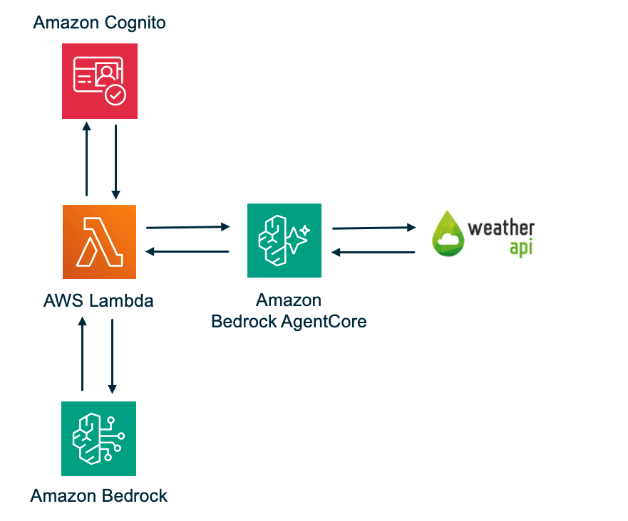

# OpenAPI Agent Gateway

A serverless AI agent system that enables natural language interaction with OpenAPI-compliant REST APIs using AWS Bedrock AgentCore Gateway and Claude Sonnet 4.5.

## Overview

The OpenAPI Agent Gateway dynamically discovers and invokes REST API operations from OpenAPI 3.x specifications. Users authenticate via Cognito JWT, submit natural language prompts to an Agent Lambda powered by Claude/Bedrock, which discovers and invokes tools dynamically generated from OpenAPI specifications through the AgentCore Gateway.

## Architecture



```
User → Agent Lambda → AgentCore Gateway (MCP) → WeatherAPI.com
            │                   │                       │
     ───────────────    ─────────────────────    ─────────────────────
     Strands Agent       CUSTOM_JWT Auth           API Key Auth
     + BedrockModel      + MCP Tool Routing        (Credential Provider
     + MCPClient         + Tool Discovery           → Secrets Manager)
            │                   │
     Cognito JWT          OpenAPI Target
     Validated            (auto-discovered)
```

- **Agent Lambda** (512MB, 120s timeout): Processes natural language prompts using Claude Sonnet 4.5, discovers tools from OpenAPI specifications via the Gateway, and orchestrates tool execution
- **AgentCore Gateway**: Handles CUSTOM_JWT auth via Cognito, exposes tools via MCP, and calls WeatherAPI.com directly using API key credential injection

## Project Structure

```
.
├── src/
│   ├── agent/              # Agent Lambda implementation
│   ├── weather_api/        # Mock Weather API Lambda implementation
│   ├── shared/             # Shared utilities and data models
│   └── openapi_parser/     # OpenAPI specification parser
├── infrastructure/         # CloudFormation templates
├── tests/                  # Unit, property, and integration tests
├── deployment/             # Deployment scripts and utilities
└── README.md
```

## Prerequisites

- Python 3.12+ — [python.org/downloads](https://www.python.org/downloads/)
- AWS CLI v2 (2.28+ recommended) — [docs.aws.amazon.com/cli/latest/userguide/install-cliv2.html](https://docs.aws.amazon.com/cli/latest/userguide/install-cliv2.html)
- AWS account with access to: Bedrock, Lambda, AgentCore Gateway, Cognito, Secrets Manager, S3, CloudWatch
- Bedrock model access enabled for Claude Sonnet 4.5 (or your chosen model) in `us-east-1`
- A free WeatherAPI.com API key — [weatherapi.com/signup.aspx](https://www.weatherapi.com/signup.aspx)

## Deployment

### Step 1: Clone the repository

Open a terminal and run:

```bash
git clone https://github.com/aws-samples/serverless-patterns
cd serverless-patterns/strands-agentcore-openapi
```

### Step 2: Set up your Python environment

```bash
python3 -m venv venv
source venv/bin/activate    # On Windows: venv\Scripts\activate
pip install -r requirements.txt
```

### Step 3: Configure AWS credentials

If you haven't already configured the AWS CLI:

```bash
aws configure
# AWS Access Key ID: <your-access-key>
# AWS Secret Access Key: <your-secret-key>
# Default region name: us-east-1
# Default output format: json
```

Verify it's working:

```bash
aws sts get-caller-identity
```

### Step 4: Get a WeatherAPI.com API key

1. Sign up at [weatherapi.com/signup.aspx](https://www.weatherapi.com/signup.aspx) (free, no credit card)
2. Verify your email and log in to [weatherapi.com/my](https://www.weatherapi.com/my/)
3. Copy your API key from the dashboard

### Step 5: Deploy

```bash
./scripts/deploy.sh \
  --environment-name dev \
  --weather-api-key YOUR_WEATHERAPI_KEY
```

The script handles everything: Secrets Manager, CloudFormation stack, credential provider, Lambda packaging, and a test user. When it finishes, run a quick test:

```bash
./scripts/test.sh 'What is the weather in Liverpool, United Kingdom?'
```

#### Deploy script options

| Flag | Default | Description |
|------|---------|-------------|
| `--environment-name` | required | Prefix for all resources (e.g. dev, prod) |
| `--weather-api-key` | required | Your WeatherAPI.com API key |
| `--model-id` | `us.anthropic.claude-sonnet-4-5-20250929-v1:0` | Bedrock model ID to use |
| `--region` | `us-east-1` | AWS region |
| `--s3-bucket` | auto-created | S3 bucket for Lambda packages |

### Step 6: Changing the model (optional)

The agent defaults to Claude Sonnet 4.5. Pass `--model-id` to use a different Bedrock model:

```bash
./scripts/deploy.sh \
  --environment-name dev \
  --weather-api-key YOUR_WEATHERAPI_KEY \
  --model-id anthropic.claude-3-5-sonnet-20241022-v2:0
```

To update a live deployment without redeploying the full stack:

```bash
aws lambda update-function-configuration \
  --function-name <agent-lambda-name> \
  --environment "Variables={BEDROCK_MODEL_ID=anthropic.claude-3-5-sonnet-20241022-v2:0,GATEWAY_ID=<gateway-id>,COGNITO_JWKS_URL=<jwks-url>}" \
  --region us-east-1
```

> When updating via CLI, the entire `Variables` map is replaced — include all existing variables.

**Available Bedrock model IDs:**

| Model | ID |
|---|---|
| Claude Sonnet 4.5 (default) | `us.anthropic.claude-sonnet-4-5-20250929-v1:0` |
| Claude 3 Sonnet | `anthropic.claude-3-sonnet-20240229-v1:0` |
| Claude 3.5 Sonnet v2 | `anthropic.claude-3-5-sonnet-20241022-v2:0` |
| Claude 3.5 Haiku | `anthropic.claude-3-5-haiku-20241022-v1:0` |
| Claude 3 Opus | `anthropic.claude-3-opus-20240229-v1:0` |
| Amazon Nova Pro | `amazon.nova-pro-v1:0` |
| Amazon Nova Lite | `amazon.nova-lite-v1:0` |

Make sure the model has access enabled in your account under **Bedrock → Model access**.

## Teardown

```bash
aws cloudformation delete-stack --stack-name openapi-agent-gateway --region us-east-1
aws cloudformation wait stack-delete-complete --stack-name openapi-agent-gateway --region us-east-1
```

To fully clean up all resources including the credential provider, secret, and S3 bucket:

1. Delete the credential provider via AWS Console (Bedrock → AgentCore → Credential Providers)
2. `aws secretsmanager delete-secret --secret-id dev-weatherapi-key --region us-east-1`
3. `aws s3 rb s3://lambda-packages-<your-account-id>-us-east-1 --force`

## Troubleshooting

**"Internal Error" on tools/call** — The Gateway execution role needs 4 resource ARN patterns for `GetResourceApiKey`: `token-vault/default`, `token-vault/default/apikeycredentialprovider/*`, `workload-identity-directory/default`, and `workload-identity-directory/default/workload-identity/{gateway-name}-*`.

**StopIteration on Lambda cold start** — `.dist-info` directories were removed during packaging. Re-run `deployment/package_lambdas.py` — it preserves them by default.

**MCPClientInitializationError ("client session is currently running")** — Do not use `with mcp_client:`. The Strands Agent calls `start()` internally via `load_tools()`. Use `try/finally` with `mcp_client.stop(None, None, None)` instead.

**AccessDeniedException on bedrock:InvokeModelWithResponseStream** — The Lambda role needs both `bedrock:ConverseStream` and `bedrock:InvokeModelWithResponseStream` (both are in the CloudFormation template).

**Lambda timeout** — The agentic loop involves multiple model calls and tool executions. Lambda is configured for 120s timeout and 1024MB memory.

## License

Copyright 2026 Amazon.com, Inc. or its affiliates. All Rights Reserved.

SPDX-License-Identifier: MIT-0
